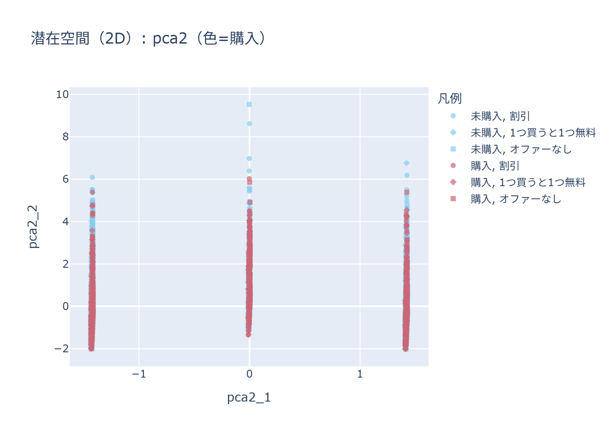
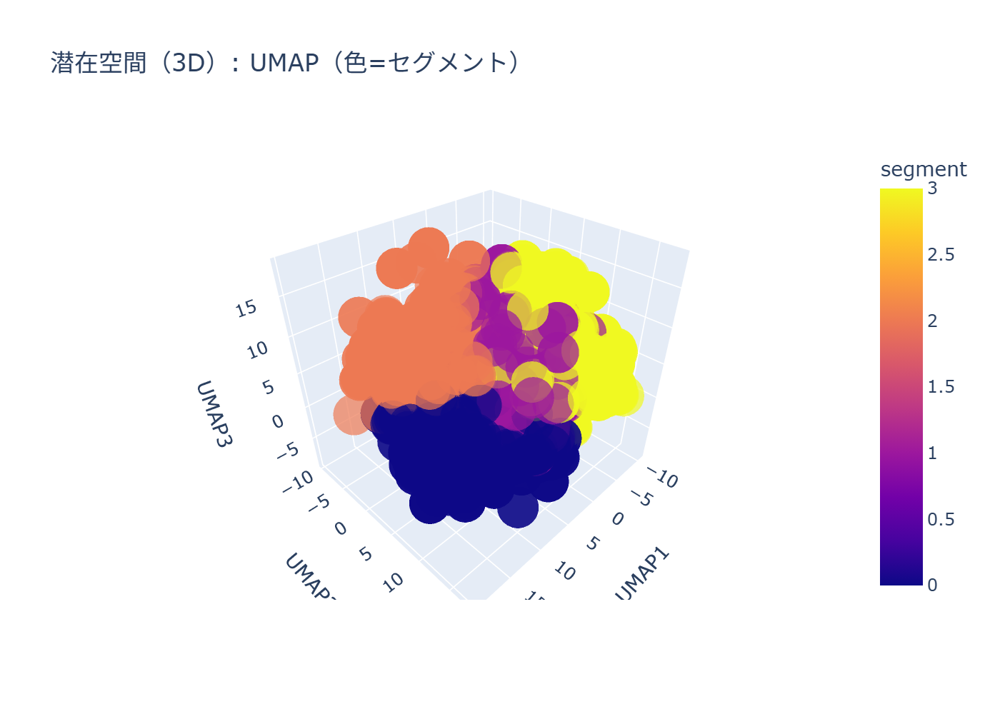

# 期待利益最大化のための分析レポート（分析担当向け）
## 0. 要約（結論）
- **顧客別最適ポリシー（mid_cost）で最頻の推奨施策**: `No Offer / Web`（100.0%）
- **示唆**: CVRが高い施策（例: 割引）は存在するが、コスト仮定が大きいと期待利益では負ける可能性がある。
- **推奨アクション**: 低コストなインセンティブへ置換し、上位スコア層（TopK%）でA/BテストしてROIが合う範囲を探索。

## 1. 目的と前提
- **目的**: `conversion`（購入）を増やしつつ、オファー/チャネルを含む施策設計で**期待利益**を最大化する。
- **価値のproxy**: `history` を購入価値のproxyとし、期待価値を \(P(購入|x)\times history\) と置く。
- **コスト仮定（感度分析）**: Discount/BOGOのコストを `history` 相対でレンジ設定（詳細は `analysis.py`）。
- **注意**: 施策効果は観察データであるため、推定は因果を保証しない（後述）。

## 2. データ概要と品質
- **行数**: 64000
- **全体CVR**: 0.1468
- **居住エリア（zip_code）**: ['農村', '郊外', '都市']
- **チャネル**: ['マルチチャネル', '電話', 'Web']
- **オファー**: ['1つ買うと1つ無料', '割引', 'オファーなし']

### 図（分布と購入差）
- **図中の n は顧客数（=行数）**を表す。

## 3. 基礎集計（CVR）と解釈
この章での **n は各カテゴリに属する顧客数（該当行数）**を表す。

### 3.1 オファー別/チャネル別

**オファー別CVR**

| オファー | n | CVR |
| --- | ---: | ---: |
| 割引 | 21307 | 0.1828 |
| 1つ買うと1つ無料 | 21387 | 0.1514 |
| オファーなし | 21306 | 0.1062 |

**チャネル別CVR**

| チャネル | n | CVR |
| --- | ---: | ---: |
| マルチチャネル | 7762 | 0.1717 |
| Web | 28217 | 0.1594 |
| 電話 | 28021 | 0.1272 |

### 3.2 オファー×チャネル
施策の効きはチャネルと相互作用し得るため、平均CVRのヒートマップで俯瞰する。

- 表の `n/CVR` は **セル内の顧客数 n と、そのセルの平均CVR** を表す。

### 3.2.1 構成比（円グラフ）
円グラフは「構成比」を直感的に把握する用途に限定して利用する（比較は棒/積み上げが基本）。

- 円グラフのタイトル末尾の `n=...` は **円グラフに含めた母集団の顧客数**（全体 or 購入者）を表す。

| オファー \ チャネル | マルチチャネル（n/CVR） | 電話（n/CVR） | Web（n/CVR） |
| --- | --- | --- | --- |
| オファーなし | 2606/0.1285 | 9327/0.0872 | 9373/0.1189 |
| 割引 | 2577/0.2115 | 9240/0.1628 | 9490/0.1944 |
| 1つ買うと1つ無料 | 2579/0.1756 | 9454/0.1318 | 9354/0.1645 |

### 3.3 比率差検定（カイ二乗）
関連の強さ（効果量）も併記し、強い特徴を優先的に追加分析・施策仮説に使う。

- 結果CSV: `artifacts/chi2_tests.csv`

| 特徴量 | n | p値 | Cramer's V |
| --- | ---: | ---: | ---: |
| オファー | 64000 | 2.869e-110 | 0.0888 |
| 紹介流入 | 64000 | 5.940e-78 | 0.0739 |
| 過去のBOGO利用 | 64000 | 1.851e-39 | 0.0520 |
| チャネル | 64000 | 1.274e-35 | 0.0501 |
| 居住エリア | 64000 | 4.637e-34 | 0.0490 |
| 過去の割引利用 | 64000 | 9.164e-02 | 0.0067 |

## 4. 予測モデル（ターゲティング）
施策対象を絞るため、購入確率モデルを構築し、TopK%でのCVR改善（リフト）を重視して評価する。

- **採用モデル（AUC最大）**: logreg

- **学習/評価データ数（holdout）**: n_train=48000, n_test=16000（層化）

### 4.1 評価（holdout・層化）
| model | AUC | Brier | Top5% CVR | Top10% CVR | Top20% CVR | Top30% CVR |
| --- | ---: | ---: | ---: | ---: | ---: | ---: |
| logreg | 0.6496 | 0.1210 | 0.2775 | 0.2681 | 0.2459 | 0.2252 |
| hgb | 0.6466 | 0.1210 | 0.3113 | 0.2687 | 0.2406 | 0.2279 |

### 4.2 図（ROC / キャリブレーション）

## 5. 潜在空間（2D）によるセグメント発見（主）
潜在空間は3Dより2Dの方が静的レポートで読みやすいため、**2Dを主**として提示する。

### 5.1 PCA(2D)

### 5.2 UMAP(2D)

### 5.3 付録：3D可視化（任意）
- 3D（HTML）は操作性は高いが、静的文書では見にくいため付録扱いにする。
- [PCA 3Dを開く](figures_html/latent3d_pca3_color_conversion.html)
- [UMAP 3Dを開く](figures_html/latent3d_umap3_color_conversion.html)

### 5.4 セグメント（UMAP 3D上のクラスタ）

- 3D（HTML）: [セグメント3Dを開く](figures_html/latent3d_umap3_color_segment.html)

- セグメント要約: `artifacts/segment_summary.csv`（利益最適の要約）
- セグメント別CVR最適: `artifacts/segment_best_cvr.csv`

| セグメント | 件数 | CVR | mean(history) | mean(recency) | mean(期待利益) | 推奨オファー（利益最適） | 推奨チャネル（利益最適） |
| --- | ---: | ---: | ---: | ---: | ---: | --- | --- |
| 2 | 17164 | 0.1524 | 335.68 | 5.42 | 55.29 | オファーなし | Web |
| 3 | 12775 | 0.1683 | 216.23 | 5.77 | 35.88 | オファーなし | Web |
| 1 | 18144 | 0.1351 | 228.91 | 5.75 | 27.49 | オファーなし | Web |
| 0 | 15917 | 0.1368 | 176.92 | 6.15 | 21.40 | オファーなし | Web |

**セグメント別の最適施策（CVR最適 vs 利益最適）**
同じセグメントでも、目的がCVR最大化か期待利益最大化かで推奨施策は変わり得る。

- **CVR最適（コスト無視の参考）**: `artifacts/segment_best_cvr.csv`
- **利益最適（コスト込み）**: `artifacts/segment_summary.csv`（mid_cost）

**セグメント別：CVR最適（予測）**

| セグメント | n | 推奨施策（CVR最適） | 平均予測購入確率 |
| --- | ---: | --- | ---: |
| 0 | 15917 | 割引 / Web | 0.1797 |
| 1 | 18144 | 割引 / Web | 0.1825 |
| 2 | 17164 | 割引 / Web | 0.2079 |
| 3 | 12775 | 割引 / Web | 0.2316 |

**解釈**:
- CVR最適では多くの場合「割引」が選ばれやすい（購入確率を押し上げるため）。
- 一方、利益最適ではコスト仮定によって「オファーなし」が選ばれることがあり、ここが“施策設計（コスト）”のボトルネックを示す。

### 5.5 セグメント別の深掘り（なぜそうなるか・何をすべきか）
各セグメントの特徴量（`history`/`recency`/`is_referral`/過去利用）から、
推奨施策がそうなる理由と、より具体的な施策案（訴求・オファー設計・チャネル）を整理する。

#### セグメント2（n=17164）
- **CVR**: 0.1524
- **平均history（価値proxy）**: 335.68
- **平均recency（月）**: 5.42
- **紹介流入率**: 0.610
- **過去の割引利用率**: 0.627
- **過去のBOGO利用率**: 0.601
- **利益最適（mid_cost）**: オファーなし / Web（平均期待利益=55.29）
- **CVR最適（参考）**: 割引 / Web（平均予測購入確率=0.2079）

**考察（なぜそうなるか）**
- CVR最適は購入確率のみを見るため、反応が出やすい『割引』が選ばれやすい。
- 利益最適は『購入確率×history−コスト』のため、historyが大きいほど割引コスト（history×割引率）も大きくなり、コスト仮定次第で『オファーなし』が有利になり得る。
- 特に高historyセグメントでは、値引き率が同じでもコスト総額が膨らむため、利益最大化はより保守的になりやすい。

**具体施策（訴求・オファー設計・チャネル）**
- **訴求**: 価格訴求だけでなく、価値訴求（限定性/利便性/新商品/まとめ買い等）でCVRを改善し、値引き依存を下げる。
- **オファー設計**: 割引率ではなく『小額固定』『ポイント』『送料無料』等に置換し、`history`に比例してコストが膨らみにくい設計にする。
- **チャネル**: 本分析の前提ではWebが低コスト。電話は高コスト想定のため、電話は高反応が見込める層に限定してテストする。

#### セグメント3（n=12775）
- **CVR**: 0.1683
- **平均history（価値proxy）**: 216.23
- **平均recency（月）**: 5.77
- **紹介流入率**: 0.293
- **過去の割引利用率**: 0.474
- **過去のBOGO利用率**: 0.725
- **利益最適（mid_cost）**: オファーなし / Web（平均期待利益=35.88）
- **CVR最適（参考）**: 割引 / Web（平均予測購入確率=0.2316）

**考察（なぜそうなるか）**
- CVR最適は購入確率のみを見るため、反応が出やすい『割引』が選ばれやすい。
- 利益最適は『購入確率×history−コスト』のため、historyが大きいほど割引コスト（history×割引率）も大きくなり、コスト仮定次第で『オファーなし』が有利になり得る。
- 特に高historyセグメントでは、値引き率が同じでもコスト総額が膨らむため、利益最大化はより保守的になりやすい。

**具体施策（訴求・オファー設計・チャネル）**
- **訴求**: 価格訴求だけでなく、価値訴求（限定性/利便性/新商品/まとめ買い等）でCVRを改善し、値引き依存を下げる。
- **オファー設計**: 割引率ではなく『小額固定』『ポイント』『送料無料』等に置換し、`history`に比例してコストが膨らみにくい設計にする。
- **チャネル**: 本分析の前提ではWebが低コスト。電話は高コスト想定のため、電話は高反応が見込める層に限定してテストする。

#### セグメント1（n=18144）
- **CVR**: 0.1351
- **平均history（価値proxy）**: 228.91
- **平均recency（月）**: 5.75
- **紹介流入率**: 0.551
- **過去の割引利用率**: 0.541
- **過去のBOGO利用率**: 0.459
- **利益最適（mid_cost）**: オファーなし / Web（平均期待利益=27.49）
- **CVR最適（参考）**: 割引 / Web（平均予測購入確率=0.1825）

**考察（なぜそうなるか）**
- CVR最適は購入確率のみを見るため、反応が出やすい『割引』が選ばれやすい。
- 利益最適は『購入確率×history−コスト』のため、historyが大きいほど割引コスト（history×割引率）も大きくなり、コスト仮定次第で『オファーなし』が有利になり得る。
- 特に高historyセグメントでは、値引き率が同じでもコスト総額が膨らむため、利益最大化はより保守的になりやすい。

**具体施策（訴求・オファー設計・チャネル）**
- **訴求**: 価格訴求だけでなく、価値訴求（限定性/利便性/新商品/まとめ買い等）でCVRを改善し、値引き依存を下げる。
- **オファー設計**: 割引率ではなく『小額固定』『ポイント』『送料無料』等に置換し、`history`に比例してコストが膨らみにくい設計にする。
- **チャネル**: 本分析の前提ではWebが低コスト。電話は高コスト想定のため、電話は高反応が見込める層に限定してテストする。

#### セグメント0（n=15917）
- **CVR**: 0.1368
- **平均history（価値proxy）**: 176.92
- **平均recency（月）**: 6.15
- **紹介流入率**: 0.499
- **過去の割引利用率**: 0.543
- **過去のBOGO利用率**: 0.457
- **利益最適（mid_cost）**: オファーなし / Web（平均期待利益=21.40）
- **CVR最適（参考）**: 割引 / Web（平均予測購入確率=0.1797）

**考察（なぜそうなるか）**
- CVR最適は購入確率のみを見るため、反応が出やすい『割引』が選ばれやすい。
- 利益最適は『購入確率×history−コスト』のため、historyが大きいほど割引コスト（history×割引率）も大きくなり、コスト仮定次第で『オファーなし』が有利になり得る。
- 特に高historyセグメントでは、値引き率が同じでもコスト総額が膨らむため、利益最大化はより保守的になりやすい。

**具体施策（訴求・オファー設計・チャネル）**
- **訴求**: 価格訴求だけでなく、価値訴求（限定性/利便性/新商品/まとめ買い等）でCVRを改善し、値引き依存を下げる。
- **オファー設計**: 割引率ではなく『小額固定』『ポイント』『送料無料』等に置換し、`history`に比例してコストが膨らみにくい設計にする。
- **チャネル**: 本分析の前提ではWebが低コスト。電話は高コスト想定のため、電話は高反応が見込める層に限定してテストする。

## 6. 施策効果の推定（傾向スコア + DR）
観察データでは、オファー/チャネルが顧客特性に依存して配布されている可能性がある。そこで (オファー,チャネル) を多値介入として扱い、
- 傾向スコア \(e(t|x)\)（多項ロジット）
- アウトカムモデル \(\mu(t,x)\)
を組み合わせたDR推定により、平均購入確率 \(E[Y(t)]\) を推定する。
推定の安定化のため、傾向スコアは下限0.01でトリミングした。

### 6.1 DR推定（上位のみ抜粋）
| 施策（オファー/チャネル） | n | 推定購入確率（DR） | アウトカムモデル平均 | 出現割合 |
| --- | ---: | ---: | ---: | ---: |
| `割引 / Web` | 9490 | 0.1892 | 0.1984 | 0.1483 |
| `割引 / マルチチャネル` | 2577 | 0.1741 | 0.1770 | 0.0403 |
| `割引 / 電話` | 9240 | 0.1673 | 0.1671 | 0.1444 |
| `1つ買うと1つ無料 / Web` | 9354 | 0.1671 | 0.1684 | 0.1462 |
| `1つ買うと1つ無料 / マルチチャネル` | 2579 | 0.1413 | 0.1466 | 0.0403 |
| `1つ買うと1つ無料 / 電話` | 9454 | 0.1303 | 0.1367 | 0.1477 |
| `オファーなし / Web` | 9373 | 0.1214 | 0.1231 | 0.1465 |
| `オファーなし / マルチチャネル` | 2606 | 0.1021 | 0.1052 | 0.0407 |
| `オファーなし / 電話` | 9327 | 0.0895 | 0.0902 | 0.1457 |

## 7. 期待利益最大化ポリシー
購入価値のproxyとして `history` を用い、期待利益を
\[ E[profit]=P(購入|x,施策)\times history - cost(offer) - cost(channel) \]
で定義。コストはレンジで感度分析し、結論の頑健性を確認する。
- 配信対象リスト: `artifacts/promo_targets.csv`（上位K%フラグ + 期待利益>0フラグ + 推奨施策）

### 7.1 コストシナリオ別サマリ（顧客別最適）

| シナリオ | n | 利益>0割合 | 平均期待利益 | 中央値期待利益 | Top5%平均 | Top10%平均 | Top20%平均 | Top30%平均 |
| --- | ---: | ---: | ---: | ---: | ---: | ---: | ---: | ---: |
| high_cost | 64000 | 1.0000 | 35.11 | 16.88 | 201.24 | 150.51 | 108.97 | 88.02 |
| low_cost | 64000 | 1.0000 | 35.11 | 16.88 | 201.24 | 150.51 | 108.97 | 88.02 |
| mid_cost | 64000 | 1.0000 | 35.11 | 16.88 | 201.24 | 150.51 | 108.97 | 88.02 |

## 8. 施策提案（考察）
- CVR観点では割引が高いが、コスト仮定が大きいと期待利益で不利になり得る。
- まずは低コストなインセンティブ設計へ置換し、TopK%でA/BテストしてROIが正となる範囲を探索する。
- セグメント運用では、値引き額を増やさずに訴求/クリエイティブ最適化でCVR改善を狙う（`segment_summary.csv`）。

## 9. 限界と次の検証
- 本分析は観察データに基づくため未観測交絡の可能性がある。
- DR推定は頑健性を高めるが、完全な因果推定を保証しない。
- 推奨ポリシーはA/Bテストで検証し、効果（CVR/利益）とコストを実測で更新する。

## 10. 追加で改善すると良い点（今後の拡張）
- **割引コストの現実値**（割引率・粗利率・BOGO原価）を入れ、期待利益の絶対値を実務に合わせて再推定する。
- **特徴量重要度/説明**: ロジスティック回帰の係数（標準化）やPermutation Importanceで“なぜ高確度か”を補強する。
- **セグメント安定性**: UMAP/KMeansの乱数やkを変えたときの頑健性（再現性）を確認し、運用に耐えるセグメントを採用する。
- **オファーの因果推定強化**: 多値介入のDRに加え、重みの分布・有効サンプルサイズ（ESS）を出して推定の信頼性を可視化する。
- **ターゲティング運用**: 上位K%だけでなく“期待利益>0”の閾値運用（接触上限/予算制約）も含めた最適化に拡張する。

## 付録：生成物
- `analysis.py` / `requirements.txt`
- `figures/`（PNG）・`figures_html/`（3D HTML）
- `artifacts/processed.csv`, `artifacts/model.joblib`, `artifacts/promo_targets.csv`
- `artifacts/chi2_tests.csv`, `artifacts/dr_treatment_effects.csv`, `artifacts/segment_summary.csv`
