# 期待利益最大化のための分析レポート（分析担当向け）
## 0. 要約（結論）
- **顧客別最適ポリシー（mid_cost）で最頻の推奨施策**: `No Offer / Web`（100.0%）
- **示唆**: CVRが高い施策（例: 割引）は存在するが、コスト仮定が大きいと期待利益では負ける可能性がある。
- **推奨アクション**: 低コストなインセンティブへ置換し、上位スコア層（TopK%）でA/BテストしてROIが合う訴求を探索。
- **最終課題（report.md）への答え**: 購入確度が高いユーザーは **モデルスコア上位（Top K%）** に偏在しやすい。プロモは **期待利益がプラス** の顧客に限定し、オファー・チャネルは §7・§10 で検証するのが望ましい。

**考察（要約）**: 本データは **n = 64000** 件、**全体CVR = 0.1468** である。mid_cost シナリオで最頻の推奨が「No Offer / Web」（100.0%）となるのは、期待利益（購入確率の予測 × `history` − コスト仮定）のもとで、**その処置が多数の顧客に対して支配的だった**ことを意味する。条件付きCVRが高い処置（例: 割引）でも、コスト項が大きければ期待利益では劣後しうる。**採用ターゲティングモデル**は AUC 最大の `{ctx['best_model']}`（logreg AUC {ctx['auc_lr']}、HGB AUC {ctx['auc_hgb']}）であり、ランキングは有用でも **個別処置効果の点推定精度**や **未観測交絡**は別問題である。経営判断では **シナリオ感度**・**OOF/ホールドアウト**・**ESS** をセットで見ることを推奨する。

## 図表ガイド（PNG と HTML）
- **静止画（PNG）**: 主に `figures/`（EDA・ROC 等）と `figures/improvements/`（診断・政策・追加サマリー）。
- **インタラクティブ（HTML）**: `figures_html/` の Plotly をブラウザで開くと拡大・回転・ホバーが可能。

### 本編 `figures/` と `figures/improvements/` の対応（主な複製）

| 内容 | 本編 | improvements 複製 |
| --- | --- | --- |
| 潜在2D PCA | `figures/latent2d_pca2_color_conversion.png` | 同名 |
| 潜在2D UMAP | `figures/latent2d_umap2_color_conversion.png` | 同名 |
| セグメント3D（PNG） | `figures/latent3d_umap3_color_segment.png` | 同名 |
| 相関（数値・二値） | `figures/improvements/corr_numeric_detailed.png` | 下三角ヒートマップ |
| recency×history 散布 | `figures/improvements/scatter_recency_history_by_conversion.png` | 色=購入 |
| OLS 係数 | `figures/improvements/ols_history_coefficients.png` | history を目的変数 |
| LSI アブレーション | `figures/improvements/ablation_base_vs_lsi_logreg.png` | BASE vs TF-IDF+SVD |
| セグ×処置CVR（探索） | `figures/improvements/segment_treatment_cvr_heatmap_exploratory.png` | 記述のみ |

### インタラクティブ図（`figures_html/`）

- [latent2d_pca2_color_conversion](figures_html/latent2d_pca2_color_conversion.html)（ブラウザで開く）
- [latent2d_umap2_color_conversion](figures_html/latent2d_umap2_color_conversion.html)（ブラウザで開く）
- [latent3d_pca3_color_conversion](figures_html/latent3d_pca3_color_conversion.html)（ブラウザで開く）
- [latent3d_umap3_color_conversion](figures_html/latent3d_umap3_color_conversion.html)（ブラウザで開く）
- [latent3d_umap3_color_segment](figures_html/latent3d_umap3_color_segment.html)（ブラウザで開く）

**考察（図表の読み方）**: 本レポートは **(i) 記述統計・視覚的EDA** → **(ii) 購入確率の予測（教師あり学習）** → **(iii) 多値介入の DR 参考推定** → **(iv) 期待利益に基づく離散政策とオフポリシー評価** → **(v) 制約・実験・ガバナンス** の順で論理を積み上げている。各図は **単独の証拠** ではなく、**複数の独立した可視化で同じストーリーが崩れないか** を確認するためのものである。

- **相関と因果**: 棒グラフ・ヒートマップの条件付きCVRは **$P(Y\mid T,\text{層})$ の記述** に過ぎず、施策の **増分効果（ATE/CATE）** を同値とみなさない。
- **再現性**: 生成パイプラインは `run_analysis.py` と `analytics/` に閉じており、乱数種・ホールドアウト比率は設定ファイルで固定できる。HTML 図は配布時にリンク切れに注意し、監査用には PNG とハッシュをセットで保管するとよい。

**フォント（図中の日本語）**: Matplotlib は `analytics/figures_jp.py` で **BIZ UDGothic**（BIZ UD ゴシック）を最優先指定しています。PC に未インストールの場合は [Google Fonts / BIZ UD フォント](https://fonts.google.com/) 等で導入するか、コード内フォールバック（Meiryo 等）に任せます。

## 1. 目的と前提
- **目的**: `conversion`（購入）を増やしつつ、オファー/チャネルを含む施策設計で**期待利益**を最大化する。
- **価値のproxy**: `history` を購入価値のproxyとし、期待価値を \(P(購入|x)\times history\) と置く。
- **コスト仮定（感度分析）**: `analytics/config.py` の `DEFAULT_SCENARIOS` を参照。
- **注意**: 施策効果は観察データであるため、推定は因果を保証しない（後述）。

**考察（目的と限界）**: 目的関数は **期待利益のオフライン代理** であり、真の会計利益・在庫コスト・クレーム処理コスト・長期LTVは含まれない。`history` は **単期の売上proxy** として $ \mathbb{E}[\text{売上}\mid x] $ の代用に過ぎず、右裾や外れ値に政策が引きずられる。コストは `DEFAULT_SCENARIOS` の感度パラメータであり、**絶対額の最適解を断定しない**。主目的は、(a) ターゲティングの当たり外れの大きさ、(b) オフラインで見える **楽観バイアス**、(c) 実験前に押さえるべき **識別・重みのリスク** を **定量的に可視化** することにある。

## 2. データ概要と品質
- **行数**: 64000
- **全体CVR**: 0.1468
- **居住エリア（zip_code）**: ['農村', '郊外', '都市']
- **チャネル**: ['マルチチャネル', '電話', 'Web']
- **オファー**: ['1つ買うと1つ無料', '割引', 'オファーなし']

### 図（分布と購入差）
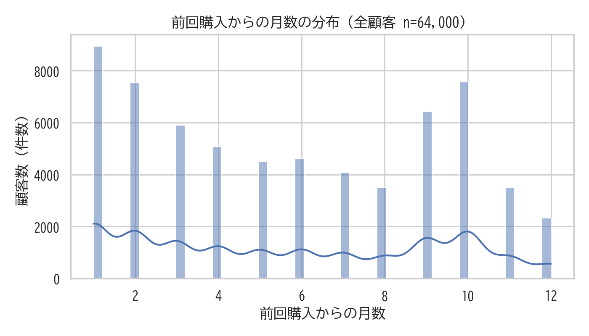

**考察（`dist_recency`）**: 周辺分布は **接触母集団における最終購入からの経過月数** の形状を示す。右裾が厚い場合は長期非購入層が厚く、リテンション施策の対象候補が可視化される。多峰性があれば **複数の購買サイクル** やデータ生成過程の異質性の兆候であり、単一指数での要約に注意する。

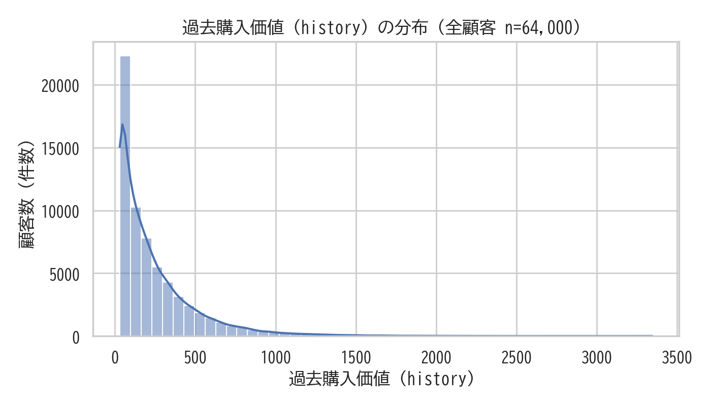

**考察（`dist_history`）**: `history` は本パイプラインでは **売上・購入規模の proxy** として期待価値に乗算される。分布の **右裾・外れ値** は少数顧客が期待利益の合計を支配しうることを意味し、ロバストな要約（中央値・トリム平均）や感度分析と併読する。

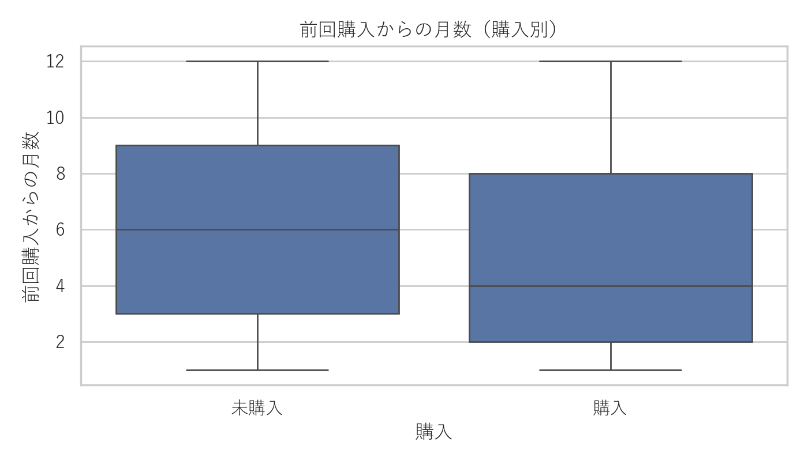

**考察（`box_recency_by_conversion`）**: 購入有無で条件付けた `recency` は **$Y=1$ 層と $Y=0$ 層の位置・ばらつきの差** を示す。中央値や四分位範囲が明瞭に分離すれば、時間軸はターゲティングに有用な信号だが、**処置 $T$ と同時に変化する交絡**（例: 最近購入した人ほど割引メールが多い）があると因果解釈は成立しない。

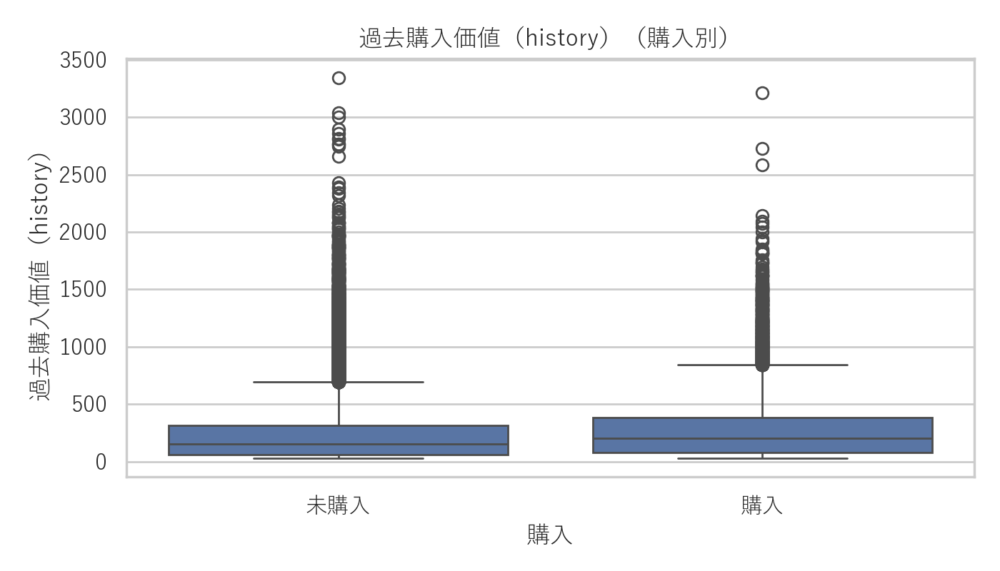

**考察（`box_history_by_conversion`）**: 高 `history` 層でCVRが高いパターンは **価値×購買意欲の相関** を示唆するが、同時に **高価値顧客ほど高コストチャネルに割り当てられている** などの設計バイアスが混ざりうる。後段の予測モデル・DR はこれらを $X$ に含めても **未観測要因** が残る限り識別できない。

**考察（分布・箱ひげ・総括）**: 以上より、EDA は **共変量の周辺と $Y$ による条件付き分布** を与える。ここから得られるのは **仮説生成と特徴量の妥当性チェック** であり、棒グラフの条件付きCVRと合わせて「どの軸で母集団が異質か」を把握する。最終的な施策効果の主張は **RCT または厳密な準実験デザイン** に委ねる。

### 属性別 CVR（棒グラフ）

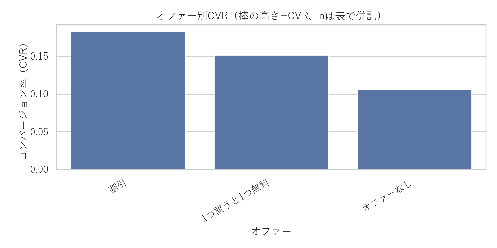

**考察（`cvr_by_offer`）**: 各棒は **同一オファー条件下の標本CVR** である。オファー間で水準が離れていても、割引が「購買意欲の高い層」に偏って割り当てられていれば **真の増分効果は棒の差より小さい** 可能性がある。政策章の期待利益は **モデル予測とコスト** に依存するため、ここでの順序と必ずしも一致しない。
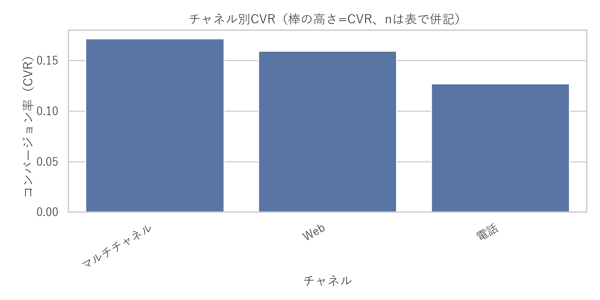

**考察（`cvr_by_channel`）**: チャネル別CVRは **接触経路と購入の関連** を示す。マルチチャネルが高い場合、**複数タッチによる学習効果**と**高意欲層の自己選択**が混在しうる。期待利益ではチャネル別コストを引くため、**CVRが高くても利益では劣後**しうる点に注意する。
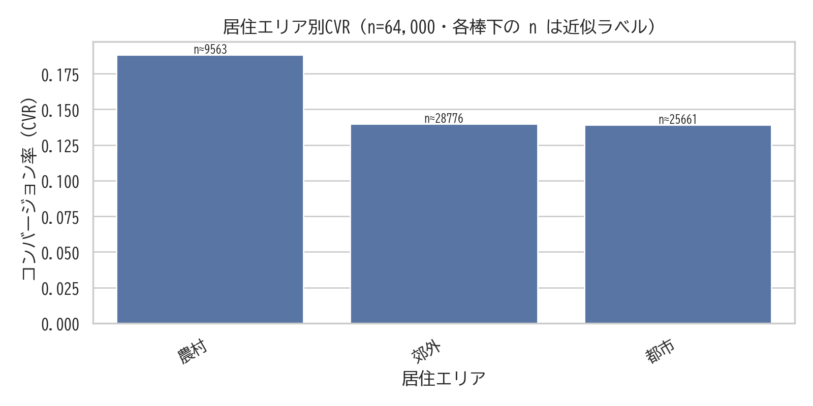

**考察（`cvr_by_zip_code`）**: 地域カテゴリは **都市性・店舗密度等の代理** である。差があっても **居住属性に基づく差別的配信** にはコンプライアンス上のリスクがあり、説明責任・利用目的の限定をデータ辞書・ガバナンス表と整合させる。
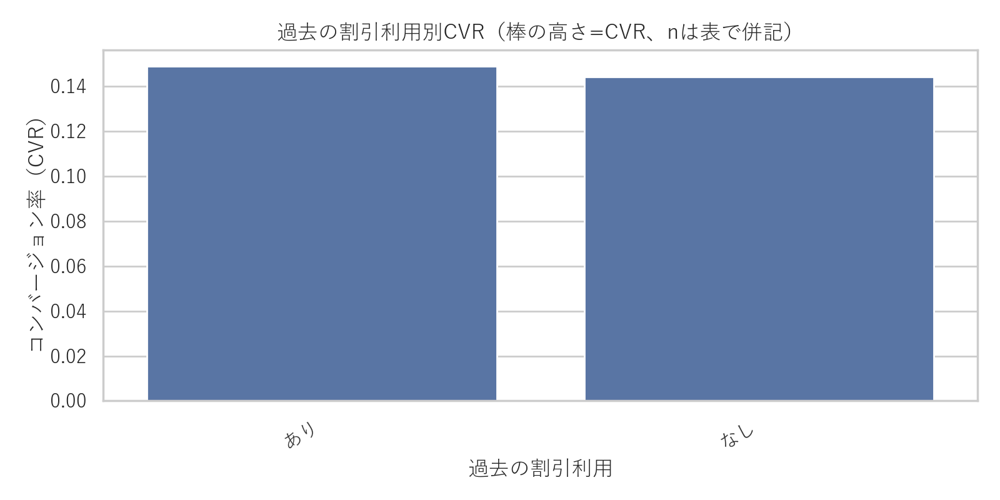

**考察（`cvr_by_used_discount`）**: 過去の割引利用は **価格感応度** と **ロイヤルティ** の両方と相関しうる。条件付きCVRの差は「プロモに慣れた層」のセグメント分けに使えるが、**過去の処置が未来の処置と相関**するなら交絡として扱う。
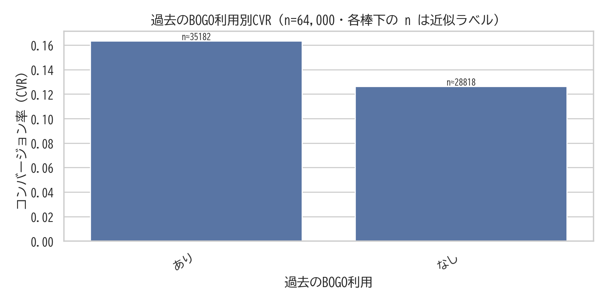

**考察（`cvr_by_used_bogo`）**: BOGO利用履歴も同様に **キャンペーン慣習** と **購買スタイル** の合成信号である。オファー主効果と分離して解釈するには、層別DRや実験が望ましい。
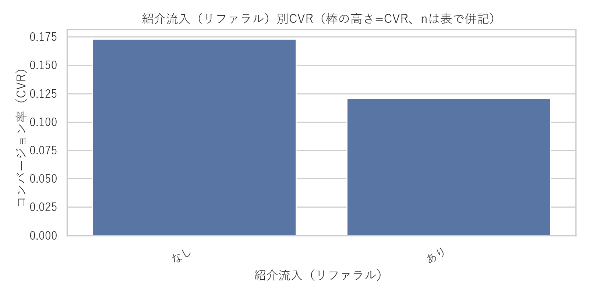

**考察（`cvr_by_is_referral`）**: 紹介フラグは **獲得チャネル品質** の代理であり、高CVRでも **母集団の事前差** の可能性が高い。紹介特典と組み合わせた施策設計では、主効果と交絡を切り分ける実験が有効である。
### 構成比（円グラフ・Plotly 出力の PNG）

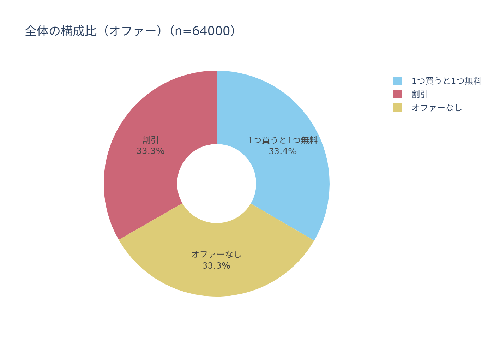

**考察（`pie_overall_offer`）**: **全件** におけるオファー構成は、分析期間中の **割当・露出のベースライン** を表す。おおよそ均等なら、単純な層別CVR比較の分母はバランスに近い。
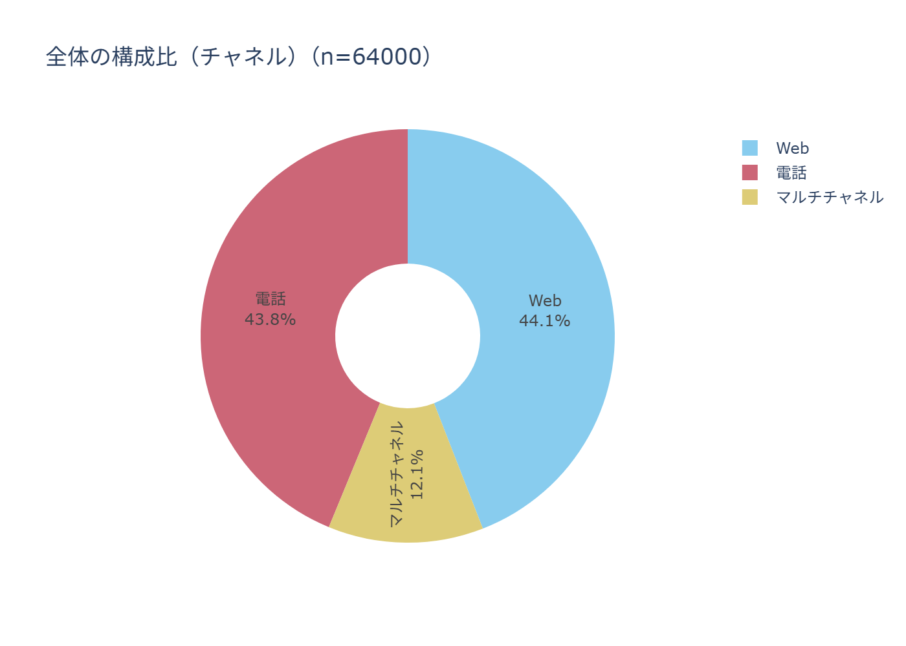

**考察（`pie_overall_channel`）**: チャネル構成は **Web中心か、マルチ・電話が少数派か** 等の運用実態を示す。後続のヒートマップでセル別nが極小にならないかと照合する。
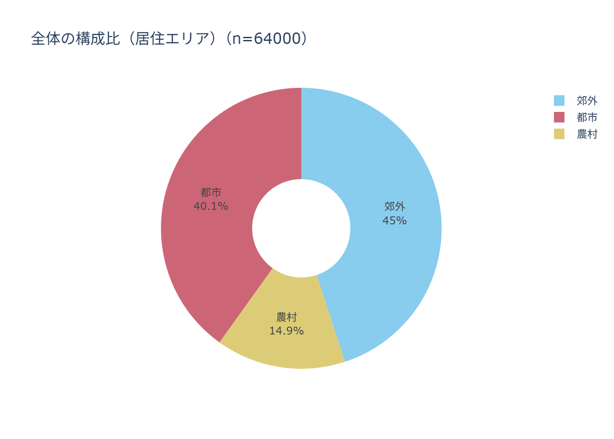

**考察（`pie_overall_zip_code`）**: 地域の全体構成は **市場カバレッジの偏り** を示す。購入者円グラフと比較し、コンバーターが特定地域に偏っていないかを見る。
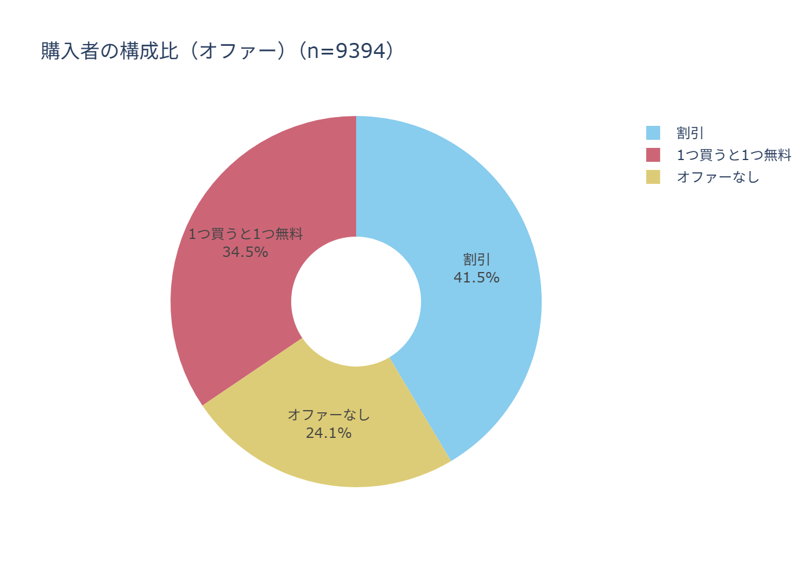

**考察（`pie_converted_offer`）**: **購入者のみ** のオファー構成は、**コンバーターにどのインセンティブが過剰代表されるか** を示す。割引の扇が広い場合、**割引が購入を「引き上げた」のか「元から買う人に配った」のか** はこの図だけでは区別できない。
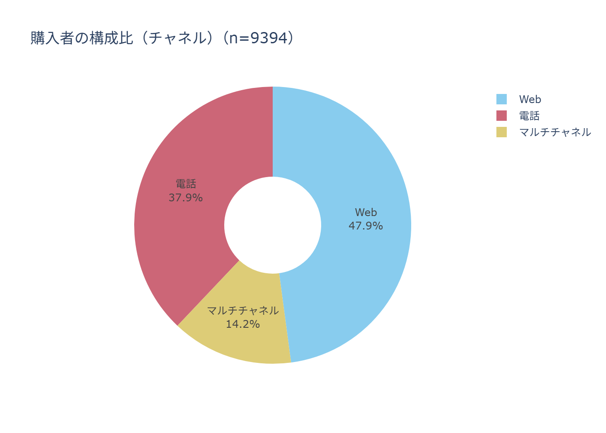

**考察（`pie_converted_channel`）**: 購入者のチャネル偏りは **コンバージョンしやすい経路** と **そこに流れる顧客の質** が混在する。全体円との差が大きいほど、チャネル別政策の見直し仮説が立つ。
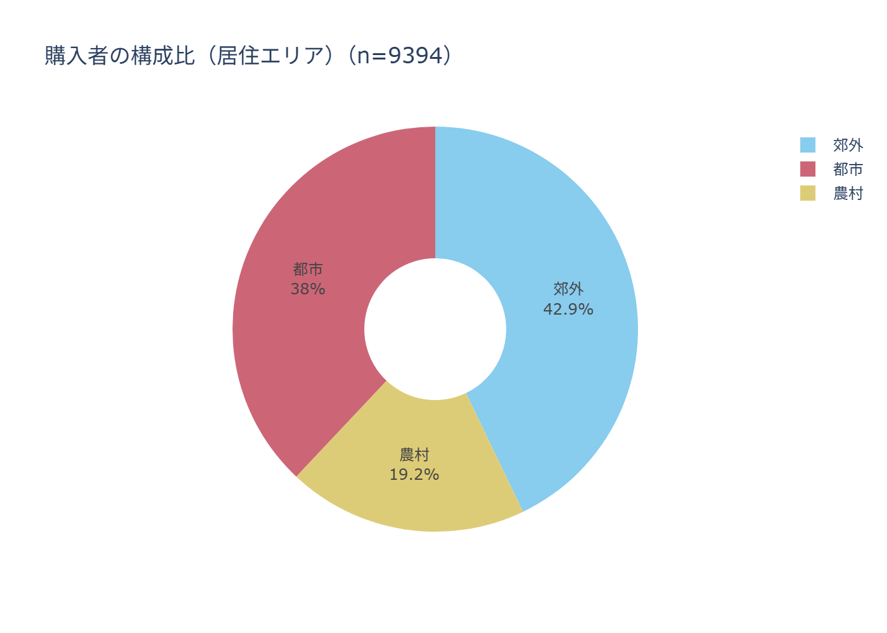

**考察（`pie_converted_zip_code`）**: 購入者の地域偏りは **店舗プロモ・ローカルイベント** 等の未観測要因と相関しうる。差別化リスクのある用途では利用制限と監査ログを前提とする。
**考察（円グラフ・全体 vs 購入者・運用上の注意）**: 二系統の円グラフを並べる意図は、**(A) 誰に施策が届いているか** と **(B) 実際に購入した人がどの属性か** を分離して見ることにある。ファイル名は `pie_*` の **ASCII スラッグ** のみを採用する（同一内容の重複PNGが文字化け名で残る場合は再現性のためレポートでは使わない）。

## 3. 基礎集計（CVR）と解釈
### 3.1 オファー別/チャネル別

**オファー別CVR**

| オファー | n | CVR |
| --- | ---: | ---: |
| 割引 | 21307 | 0.1828 |
| 1つ買うと1つ無料 | 21387 | 0.1514 |
| オファーなし | 21306 | 0.1062 |

**チャネル別CVR**

| チャネル | n | CVR |
| --- | ---: | ---: |
| マルチチャネル | 7762 | 0.1717 |
| Web | 28217 | 0.1594 |
| 電話 | 28021 | 0.1272 |

### 3.2 オファー×チャネル
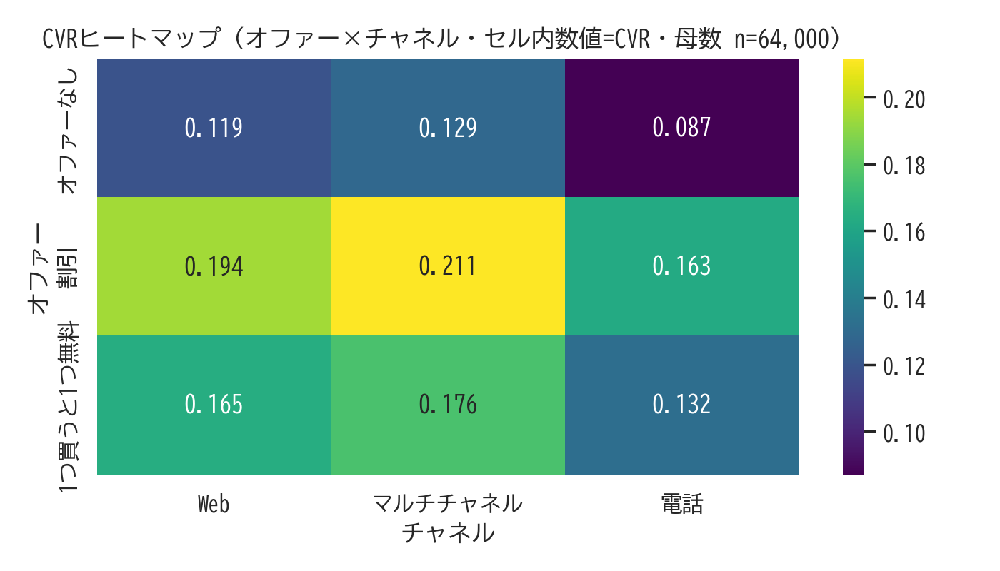

**考察（オファー×チャネル・ヒートマップ）**: 各セルは **有限標本の条件付きCVR** である。統計的には **オファー主効果・チャネル主効果・交互作用** が同時に絡む。セル内 $n$ が小さい（マルチチャネル行など）場合、色の濃淡は **標準誤差が大きい** ので、セクション3の数表の $n$ と必ず併読する。交互作用が強い場合、**一律オファー**より **チャネル別カスタム** が期待利益で有利になりうるが、コストと識別を別途確認する。

| オファー \ チャネル | マルチチャネル（n/CVR） | 電話（n/CVR） | Web（n/CVR） |
| --- | --- | --- | --- |
| オファーなし | 2606/0.1285 | 9327/0.0872 | 9373/0.1189 |
| 割引 | 2577/0.2115 | 9240/0.1628 | 9490/0.1944 |
| 1つ買うと1つ無料 | 2579/0.1756 | 9454/0.1318 | 9354/0.1645 |

### 3.3 比率差検定（カイ二乗）と BH-FDR
- 詳細: `artifacts/chi2_tests_with_fdr.csv`

| 特徴量 | n | p値 | q値(BH) | Cramér's V |
| --- | ---: | ---: | ---: | ---: |
| オファー | 64000 | 2.869e-110 | 1.722e-109 | 0.0888 |
| 紹介流入 | 64000 | 5.940e-78 | 1.782e-77 | 0.0739 |
| 過去のBOGO利用 | 64000 | 1.851e-39 | 3.701e-39 | 0.0520 |
| チャネル | 64000 | 1.274e-35 | 1.911e-35 | 0.0501 |
| 居住エリア | 64000 | 4.637e-34 | 5.564e-34 | 0.0490 |
| 過去の割引利用 | 64000 | 9.164e-02 | 9.164e-02 | 0.0067 |

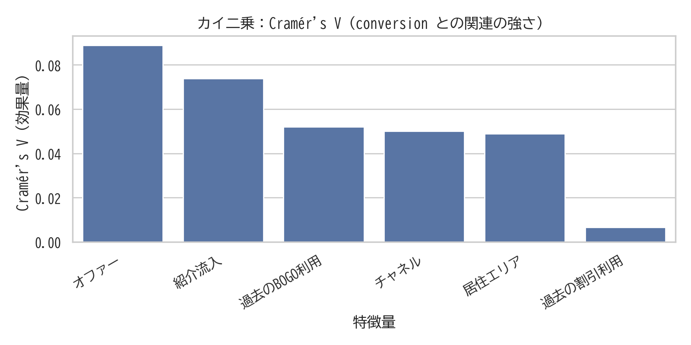

**考察（カイ二乗・BH-FDR・Cramér's V）**: 各検定は **購入フラグとカテゴリ特徴量の独立性** を問う。p値はサンプルサイズに敏感であり、本データのように n が大きいと **実務的には微小な依存でも「有意」** になりやすい。Benjamini--Hochberg の q 値は **偽発見率（FDR）** を抑える手がかりだが、**検定の前提（期待度数）** や **カテゴリのまとめ方** に依存する。Cramér's V は **連関の正規化効果量** であり、**有意だが V が極小** のときはビジネスインパクトは限定的と解釈しうる。後段のロジスティック回帰では **多重共線性** により個別係数の解釈が難しくなる場合がある。

### 3.4 相関分析（数値・二値項目）
`recency`, `history`, `used_discount`, `used_bogo`, `is_referral`, `conversion` の **Pearson 相関**（下三角のみ）。強い相関は共線性の手がかりであり、因果ではない。

- 数値表: `artifacts/correlation_numeric.csv`

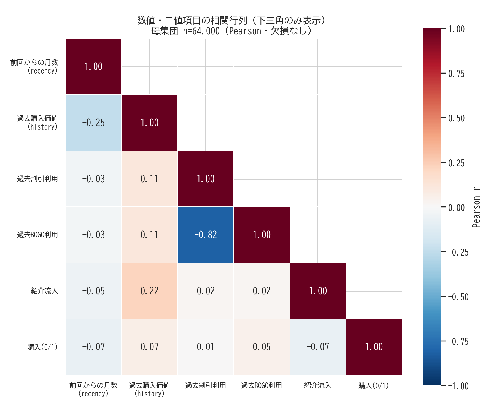

recency と history は購入有無で分布が異なる（透明度で重なりを表現）。

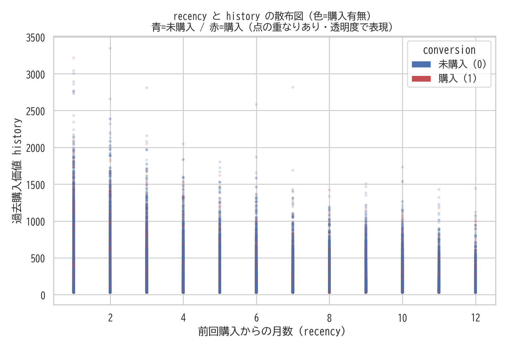

### 3.5 重回帰分析（OLS・目的変数 history）
演習で例示される重回帰に対応し、`history` を目的変数とした **OLS**（説明: `recency`, `used_discount`, `used_bogo`, `is_referral`、HC1）。購入予測は §4 のロジスティックが主。

- 係数: `artifacts/ols_history_coefficients.csv` / 要約: `artifacts/ols_history_summary.txt`

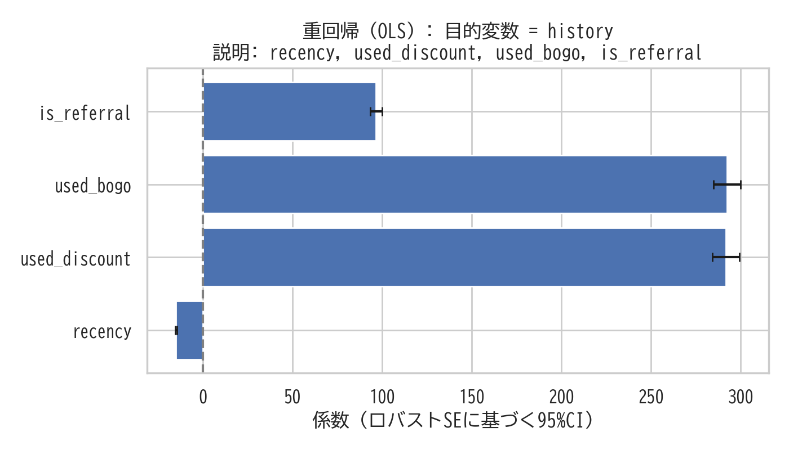

## 4. 予測モデル（ターゲティング）
- **採用モデル（AUC最大）**: logreg
- **学習/評価**: n_train=48000, n_test=16000

| model | AUC | Brier | AP | Top5% CVR | Top10% CVR |
| --- | ---: | ---: | ---: | ---: | ---: |
| logreg | 0.6496 | 0.1210 | 0.2286 | 0.2775 | 0.2681 |
| hgb | 0.6466 | 0.1210 | 0.2267 | 0.3113 | 0.2687 |

### ROC 曲線・キャリブレーション（ホールドアウト）

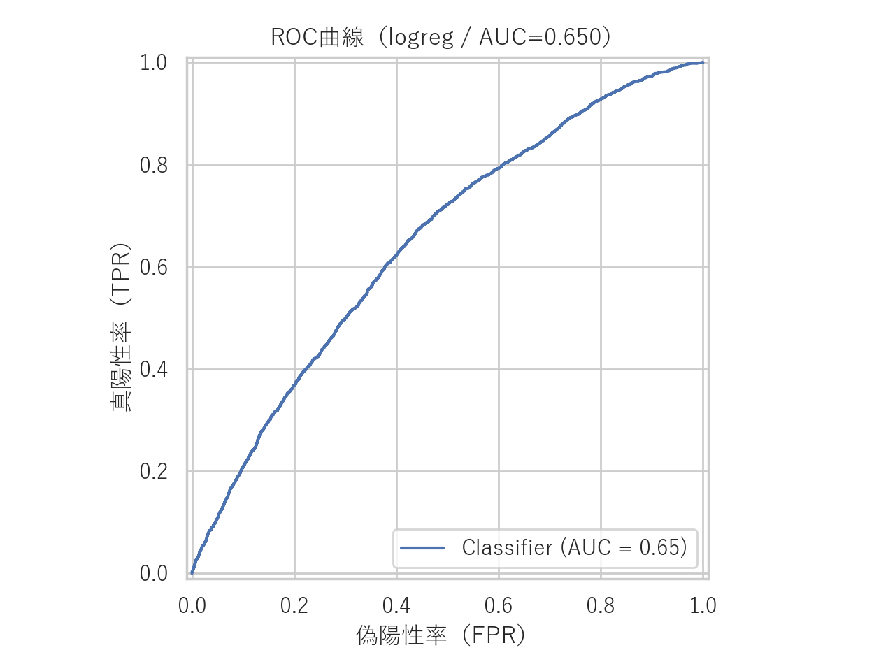

**考察（ROC・logreg）**: ROC は **すべての分類閾値における TPR と FPR のトレードオフ** を描く。logreg は線形境界のため、特徴量空間が強く非線形なら AUC が頭打ちになりうる。本結果の AUC は **中程度の判別力** を示唆し、**完全分離には至っていない** と読める。
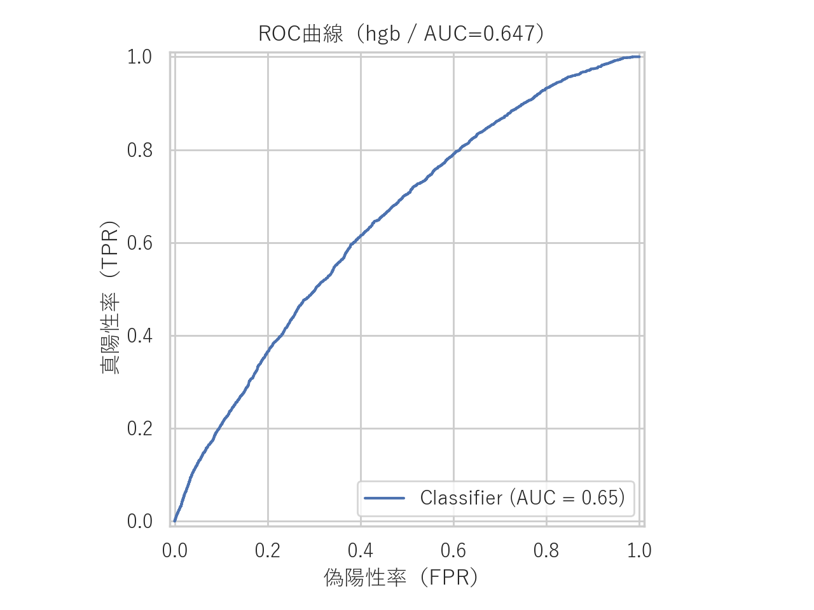

**考察（ROC・HGB）**: 勾配ブースティング木は **交互作用・非線形** を取り込み、AUC が logreg と近い場合でも **TopK 層の純度** が異なることがある（表の Top5% CVR を参照）。過学習は **OOF・ホールドアウト** で監視する。
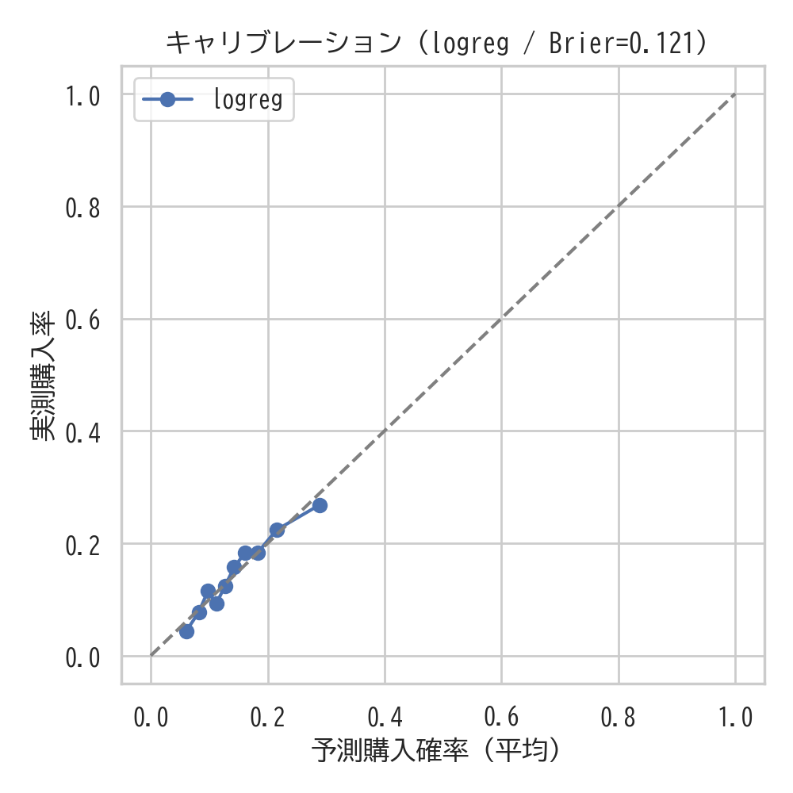

**考察（校正・logreg）**: 校正図（リライアビリティ・ダイアグラム）は **予測確率ビンごとの観測頻度** と **予測平均** の一致を見る。対角からの systematic な乖離は **期待利益の絶対値** を歪めるため、本番では **Platt scaling / isotonic** やモニタリングでの再較正を検討する。
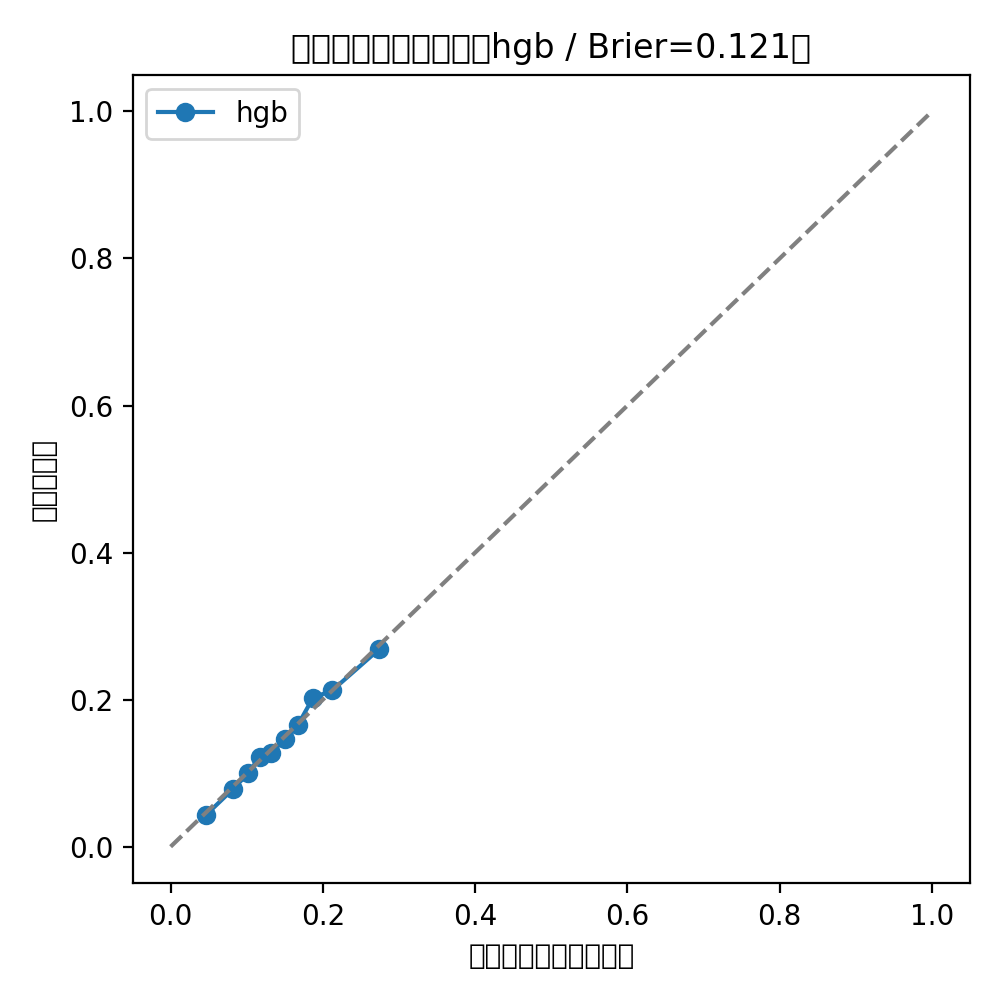

**考察（校正・HGB）**: 木モデルは **スコアの較正が崩れやすい** 傾向があり、ランキングは良くても **確率の絶対水準** が信頼できない場合がある。政策は **閾値・期待値** に依存するため、校正悪化は **優先順位の誤り** に直結しうる。
**考察（ROC・校正・総括）**: **ROC/AUC** は閾値非依存の **ランキング性能**、`Brier` は **確率予測の二乗誤差** を与える。施策最適化で **期待利益の絶対比較** をする場合、**較正の良さ** が特に重要になる。逆に **TopK% だけを切り取る** 運用では、ランキングの順序が主で、校正は二次的になりうるが、**ホールドアウトでの一貫性** は依然として確認すべきである。

### PR曲線（改善）
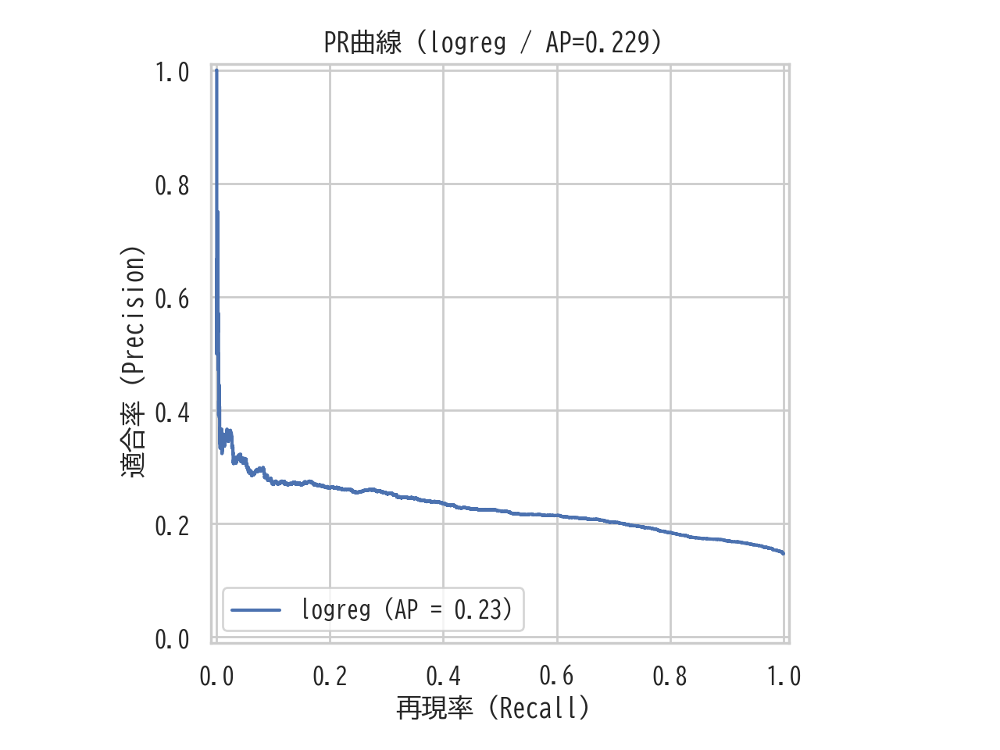

**考察（PR 曲線・logreg）**: PR 曲線は **陽性クラスが稀** なとき、高い閾値側の **Precision と Recall** のトレードオフを直感的に示す。Average Precision（AP）は **陽性に対する予測ランキングの要約** であり、ベースレート（全体CVR）よりどれだけ上回るかが実務的な基準になる。

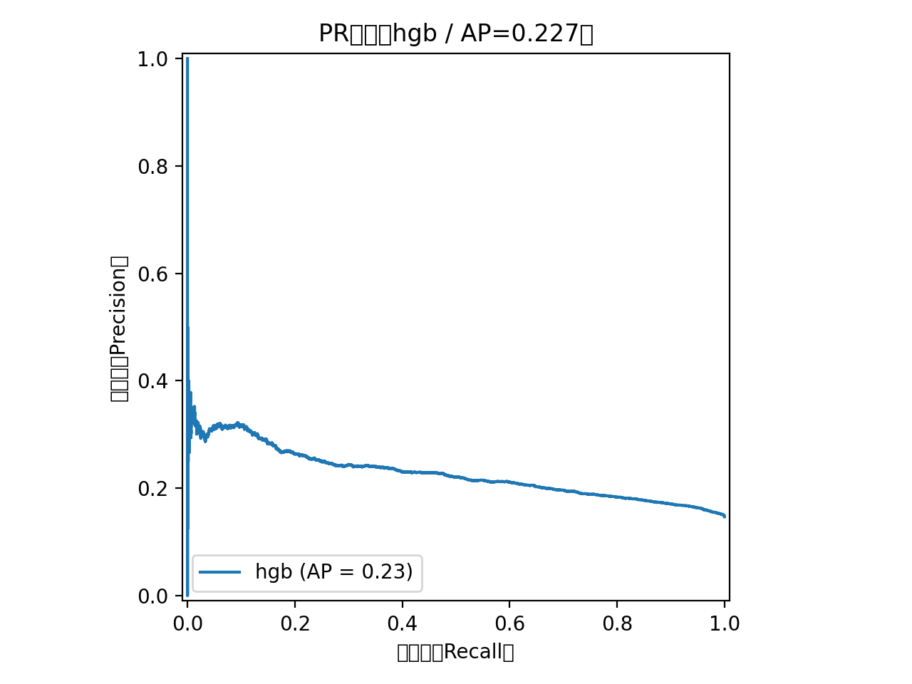

**考察（PR 曲線・HGB）**: HGB の PR が logreg と近い場合でも、**上位尾の顧客集合** は一致しないことがある。オフラインでは **Top5%/Top10% の実測CVR**（表）と **政策シミュレーション** を併せて判断する。

**考察（PR 曲線・総括）**: 陽性率が ~15% 前後でも ROC だけでは **高確率帯の挙動** が見えにくいことがある。PR と **累積ゲイン曲線** は「限られた接触枠」を前提にしたときの **取りこぼしと誤配信** のバランスを議論するのに適する。

### 4.5 TF-IDF + SVD（LSI 類似）を加えたロジスティック回帰（アブレーション）
行を英語テンプレにし、**訓練のみ**で fit した TF-IDF・TruncatedSVD を連結（次元は `artifacts/lsi_tfidf_diag.json`）。同一ホールドアウトで BASE との比較（API 不要）。

| variant | AUC | Brier | AP | Top5% CVR | Top10% CVR |
| --- | ---: | ---: | ---: | ---: | ---: |
| base_only | 0.6496 | 0.1210 | 0.2286 | 0.2775 | 0.2681 |
| base_plus_lsi_tfidf_svd | 0.6492 | 0.1211 | 0.2277 | 0.2787 | 0.2656 |

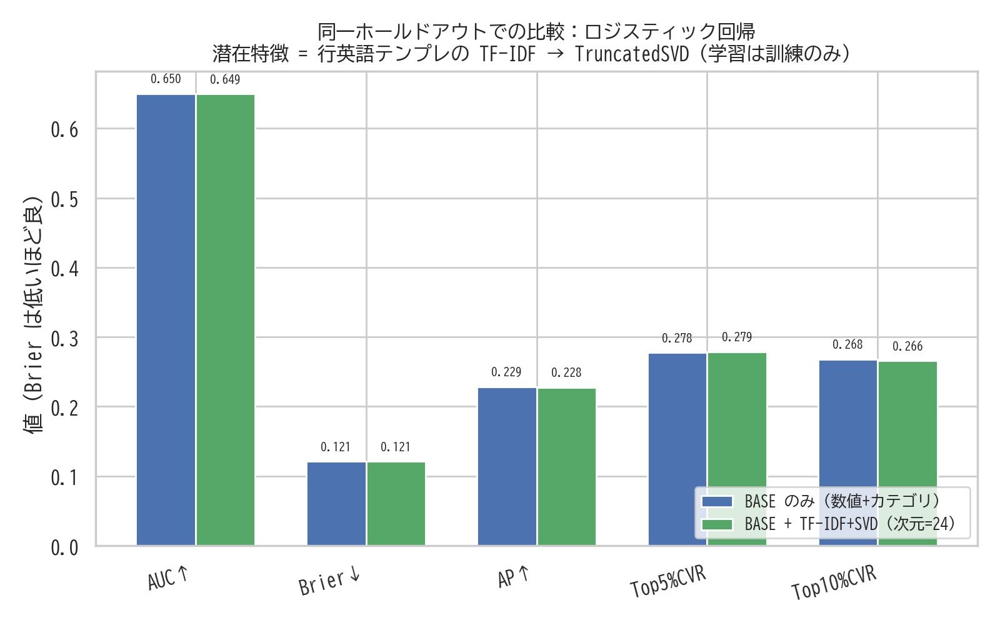

## 5. 潜在空間とセグメント
潜在空間の PNG は `figures/improvements/` にも複製（本編 `figures/` との対応はファイル名同一）。

**考察（PCA 2D・購入着色）**: 主成分分析は **線形な分散最大方向** への投影である。購入（色）が分離して見えるなら、**線形境界で説明可能な購買構造** が存在する兆候である。分離が弱い場合でも、**後続の非線形可視化（UMAP）** で構造が現れることがある。

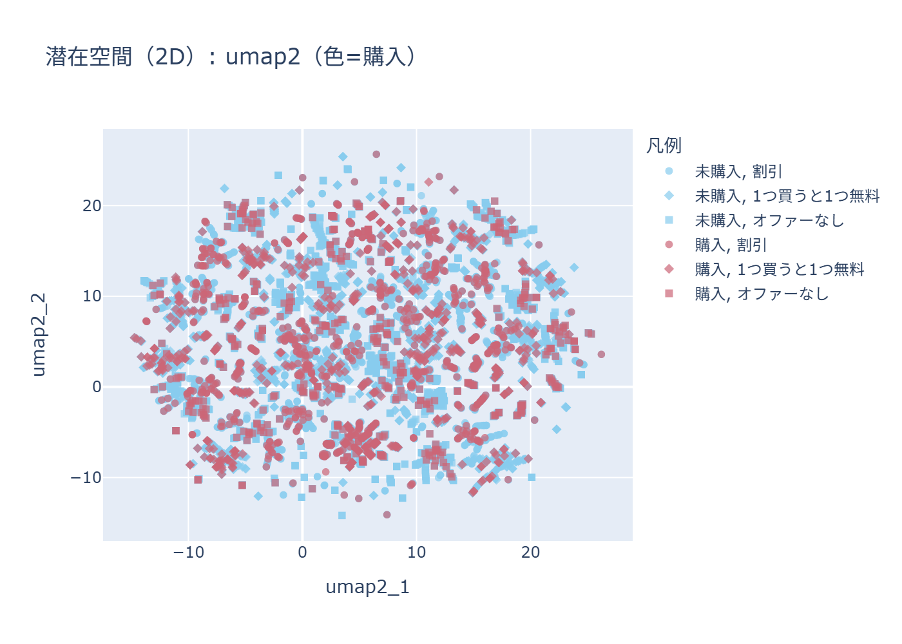

**考察（UMAP 2D）**: UMAP は **局所的な近傍構造** を保つよう設計された次元削減であり、**大域的距離は厳密に解釈しない**。クラスタリング入力として用いる場合、**ハイパラ（近傍数・最小距離）** がラベルに影響するため、**ARI による安定性確認** が必須である。

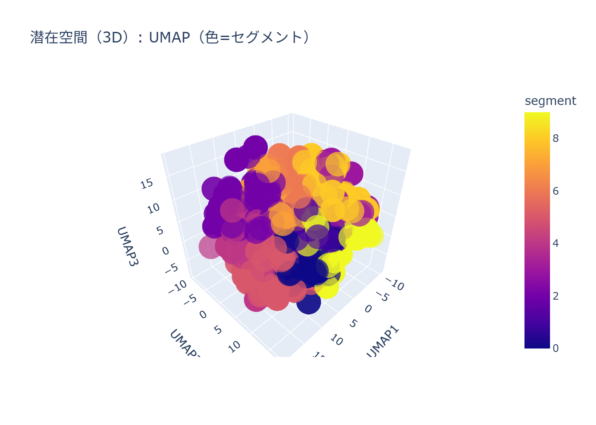

**考察（UMAP 3D・セグメント着色）**: 3D は **クラスタの分離** と **クラスタ間の近接関係** を把握するのに有用だが、投影の回転は恣意的である。HTML 版で **インタラクティブに回転** し、**重なり** と **外れ値クラスタ** を確認する。

**3D 操作版**: [UMAP×購入](figures_html/latent3d_umap3_color_conversion.html) / [UMAP×セグメント](figures_html/latent3d_umap3_color_segment.html) / [PCA×購入](figures_html/latent3d_pca3_color_conversion.html)

**2D 操作版（拡大・ホバー）**: [PCA 2D](figures_html/latent2d_pca2_color_conversion.html) / [UMAP 2D](figures_html/latent2d_umap2_color_conversion.html)

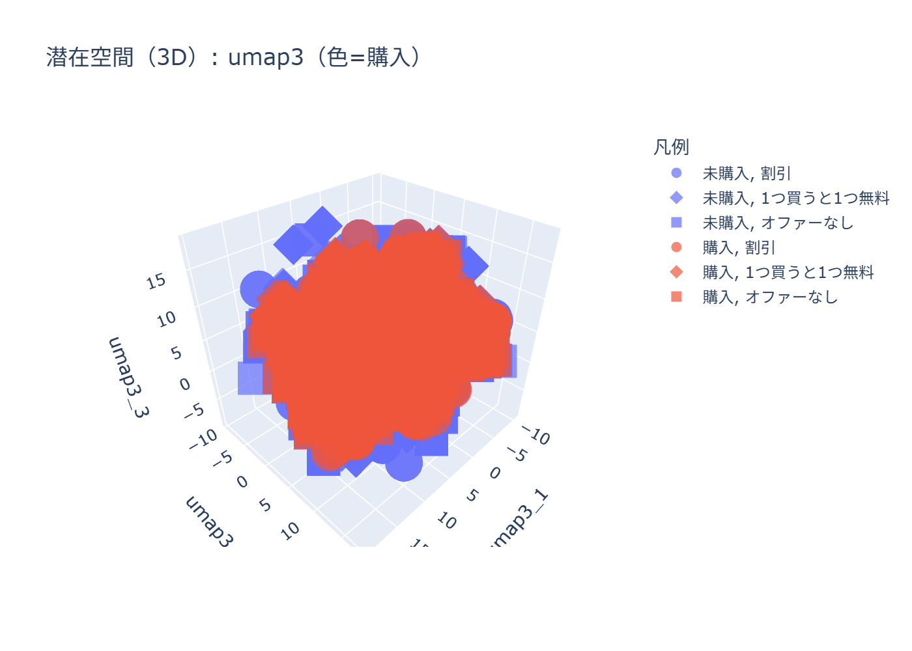

**考察（3D 静止画 PNG）**: 静止画は **特定視点のスナップショット** に過ぎない。レポート掲載用であり、**構造の主張は HTML または複数視点** で補強するのが望ましい。

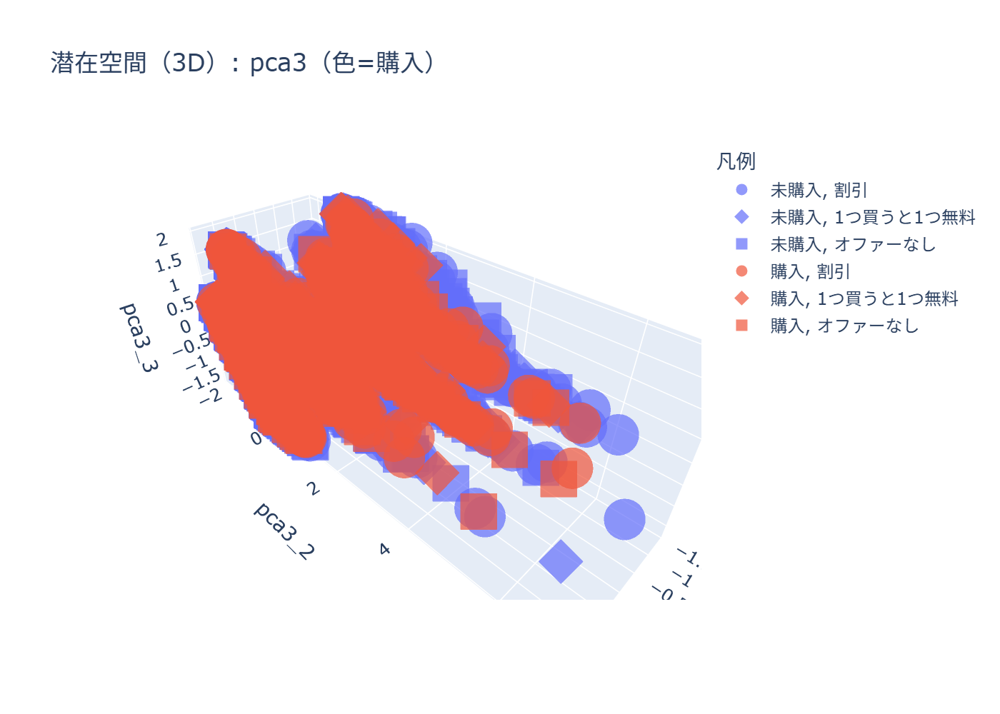

**考察（3D 静止画 PNG）**: 静止画は **特定視点のスナップショット** に過ぎない。レポート掲載用であり、**構造の主張は HTML または複数視点** で補強するのが望ましい。

**考察（潜在空間・総括）**: PCA と UMAP は **探索的** な可視化であり、**因果や最適政策の証明** にはならない。セグメント色は **説明用ラベル**（KMeans 等）であり、**センシティブ属性のプロキシ化** に使う場合は倫理審査と **人による最終判断** を前提とする。

- `artifacts/cluster_labels_auto.csv`（シルエット自動k） / `artifacts/cluster_labels_k4.csv`（参考k=4）
- シルエット: 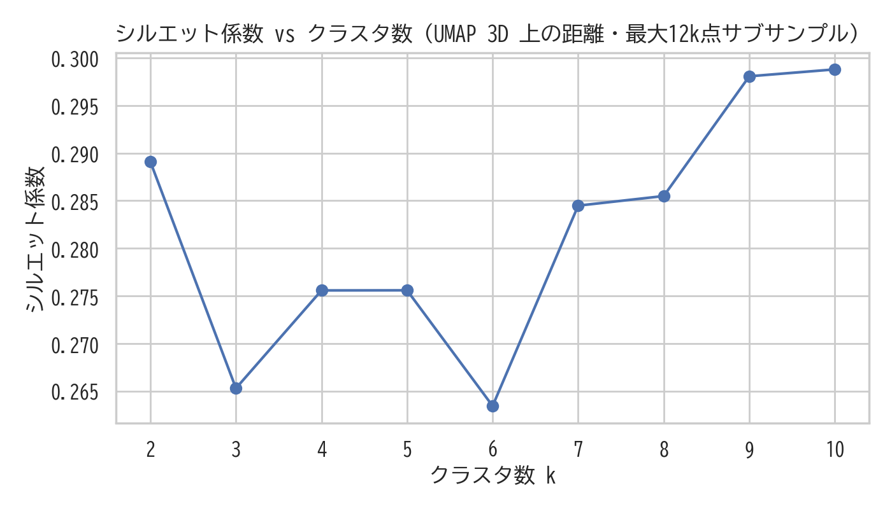

**考察（シルエット vs $k$）**: シルエット係数は **クラスタ内凝集度とクラスタ間分離** のバランスを要約する。ピークの $k$ を **機械的に「真のクラス数」** とみなさず、**業務解釈可能性** と **ARI** と三点セットで決める。$k$ を増やすほどシルエットが上がる場合でも **過分割** の危険がある。

- 安定性: 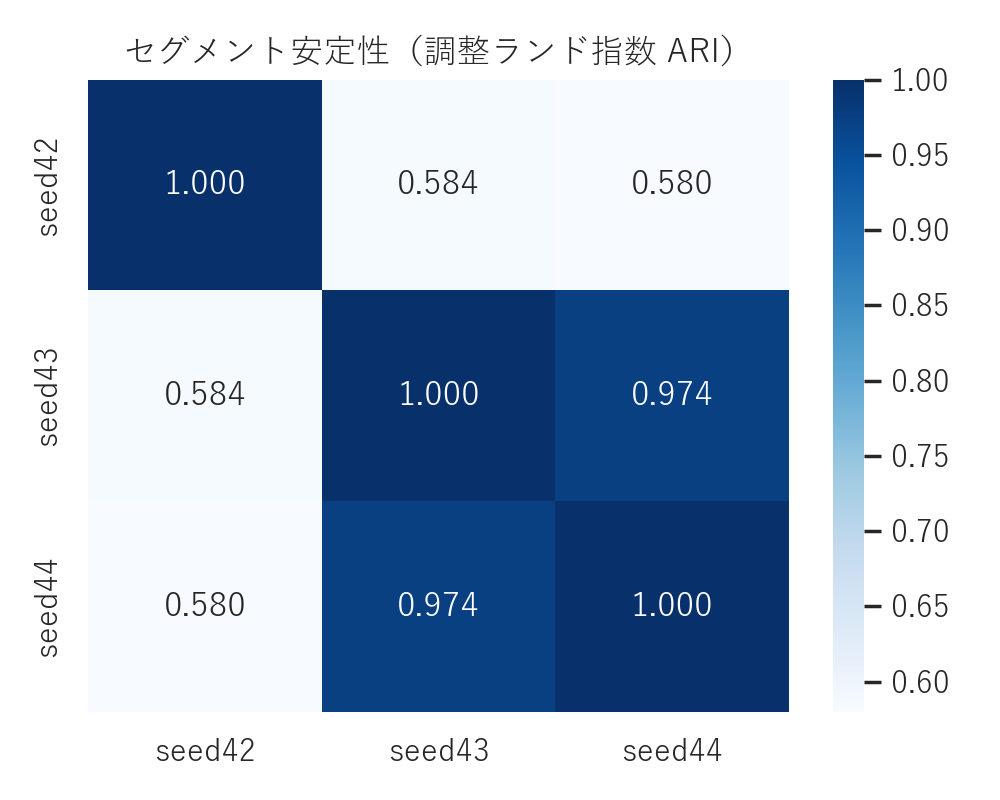

**考察（多シード ARI）**: 調整ランド指数（ARI）は **異なる乱数シードで KMeans を回したときのラベル一致度** を測る。1 に近いほど **局所解に依存しにくい** 安定したクラスタ構造を示唆する。ARI が低いとき、セグメント別メッセージを固定ルール化すると **再現性のない運用** になりうる。

**考察（クラスタ数と安定性・総括）**: **データ駆動の $k$** は出発点に過ぎず、**セグメント施策のROI** は別途 OOF 期待利益で検証する。安定性が低い場合は **スコア層（デシル）** への回帰や **階層クラスタ** を検討する。

### 5.0 セグメント×処置の観測CVR（探索・記述のみ）
交絡ありのため因果解釈不可。`artifacts/segment_treatment_cvr_exploratory.csv` を参照。

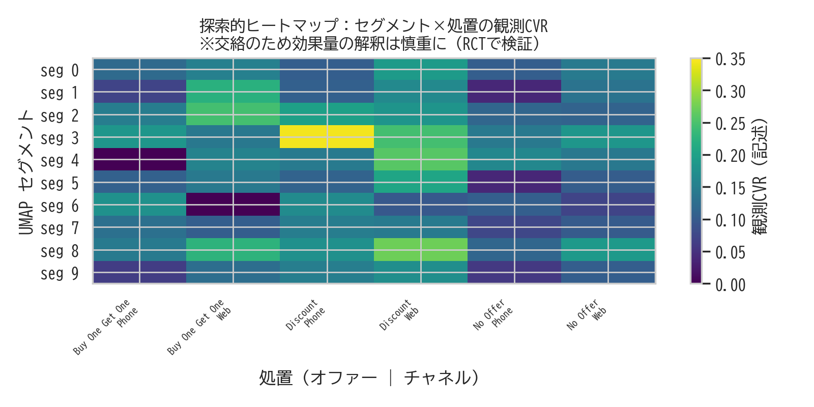

### セグメント要約（mid_cost・主クラスタ）
| セグメント | 件数 | CVR | mean(history) | mean(recency) | mean(期待利益) | 推奨オファー | 推奨チャネル |
| --- | ---: | ---: | ---: | ---: | ---: | --- | --- |
| 2 | 9965 | 0.1700 | 386.87 | 5.22 | 70.21 | オファーなし | Web |
| 3 | 5378 | 0.1967 | 240.96 | 5.78 | 45.16 | オファーなし | Web |
| 7 | 6303 | 0.1245 | 272.15 | 5.68 | 36.20 | オファーなし | Web |
| 8 | 5809 | 0.1766 | 192.44 | 5.76 | 31.03 | オファーなし | Web |
| 1 | 9462 | 0.1335 | 252.08 | 5.65 | 28.72 | オファーなし | Web |
| 4 | 4089 | 0.1653 | 205.51 | 6.10 | 28.51 | オファーなし | Web |
| 0 | 5471 | 0.1477 | 186.01 | 6.03 | 24.77 | オファーなし | Web |
| 6 | 3589 | 0.1432 | 184.18 | 6.07 | 24.16 | オファーなし | Web |
| 5 | 7420 | 0.1235 | 181.60 | 6.00 | 20.76 | オファーなし | Web |
| 9 | 6514 | 0.1004 | 193.06 | 5.96 | 20.14 | オファーなし | Web |

**考察（セグメント要約表）**: 各行は **クラスタ $k$ 内の顧客に対する記述統計と、モデルが推奨する処置のモード（代表値）** をまとめたものである。セグメント間で推奨が **ほぼ同一** なら、運用上は **セグメント別ルール** より **スコア層での一本化** がシンプルで誤りも少ない。逆に **プロファイルと利益が大きく異なる** クラスタは、**メッセージ検証** を分けた A/B の単位になりうる。

### セグメント別ナラティブ（z・置換重要度・SHAP）
- **セグメント 0**: 主な特徴（全体比z）: history: z=-0.22, is_referral: z=-0.12, recency: z=+0.08
  - 置換重要度（上位）: offer: 0.0000, channel: 0.0000, is_referral: 0.0000
  - SHAP線形（|φ|平均・購入クラス）: num__used_bogo: 0.3617, cat__offer_No Offer: 0.2878, num__used_discount: 0.2866
- **セグメント 1**: 主な特徴（全体比z）: used_bogo: z=-0.39, is_referral: z=+0.30, used_discount: z=+0.19
  - 置換重要度（上位）: offer: 0.0000, channel: 0.0000, is_referral: 0.0000
  - SHAP線形（|φ|平均・購入クラス）: num__used_bogo: 0.3737, num__used_discount: 0.2866, num__is_referral: 0.2834
- **セグメント 2**: 主な特徴（全体比z）: history: z=+0.57, is_referral: z=+0.40, used_discount: z=+0.34
  - 置換重要度（上位）: is_referral: 0.0008, offer: 0.0000, channel: 0.0000
  - SHAP線形（|φ|平均・購入クラス）: num__used_bogo: 0.3474, num__is_referral: 0.2885, num__used_discount: 0.2866
- **セグメント 3**: 主な特徴（全体比z）: is_referral: z=-0.42, used_bogo: z=+0.33, used_discount: z=+0.22
  - 置換重要度（上位）: recency: 0.0003, offer: 0.0002, used_discount: 0.0000
  - SHAP線形（|φ|平均・購入クラス）: num__used_bogo: 0.3488, num__used_discount: 0.2866, num__is_referral: 0.2645
- **セグメント 4**: 主な特徴（全体比z）: used_bogo: z=-0.44, is_referral: z=-0.33, used_discount: z=+0.24
  - 置換重要度（上位）: used_bogo: 0.0012, offer: 0.0000, channel: 0.0000
  - SHAP線形（|φ|平均・購入クラス）: num__used_bogo: 0.3749, num__used_discount: 0.2866, num__is_referral: 0.2660
- **セグメント 5**: 主な特徴（全体比z）: history: z=-0.24, used_discount: z=-0.19, is_referral: z=+0.11
  - 置換重要度（上位）: offer: 0.0000, channel: 0.0000, is_referral: 0.0000
  - SHAP線形（|φ|平均・購入クラス）: num__used_bogo: 0.3593, cat__offer_No Offer: 0.3008, num__used_discount: 0.2866
- **セグメント 6**: 主な特徴（全体比z）: used_discount: z=-0.80, is_referral: z=-0.69, used_bogo: z=+0.59
  - 置換重要度（上位）: offer: 0.0000, channel: 0.0000, is_referral: 0.0000
  - SHAP線形（|φ|平均・購入クラス）: num__used_bogo: 0.3405, num__used_discount: 0.2866, cat__offer_No Offer: 0.2744
- **セグメント 7**: 主な特徴（全体比z）: history: z=+0.12, used_bogo: z=-0.09, used_discount: z=-0.06
  - 置換重要度（上位）: offer: 0.0000, channel: 0.0000, is_referral: 0.0000
  - SHAP線形（|φ|平均・購入クラス）: num__used_bogo: 0.3632, num__used_discount: 0.2866, cat__offer_No Offer: 0.2802
- **セグメント 8**: 主な特徴（全体比z）: used_discount: z=-0.91, is_referral: z=-0.81, used_bogo: z=+0.71
  - 置換重要度（上位）: offer: 0.0000, channel: 0.0000, is_referral: 0.0000
  - SHAP線形（|φ|平均・購入クラス）: num__used_bogo: 0.3330, num__used_discount: 0.2866, cat__offer_No Offer: 0.2826
- **セグメント 9**: 主な特徴（全体比z）: is_referral: z=+0.61, used_bogo: z=-0.59, used_discount: z=+0.39
  - 置換重要度（上位）: offer: 0.0000, channel: 0.0000, is_referral: 0.0000
  - SHAP線形（|φ|平均・購入クラス）: num__used_bogo: 0.3806, cat__offer_No Offer: 0.3495, num__is_referral: 0.2915

**考察（z・SHAP・置換重要度）**: **$z$ スコア** はクラスタ平均が全体平均から何標準偏差離れているかの **単変量プロファイル** である。**SHAP**（線形近似）は **局所的な予測分解**、**置換重要度** は **汎用的だが相関により水増し** されうる。説明可能性の目的では **上位要因を2–3個に要約** し、残りは **人のドメイン知識** で補うのが実務的である。

## 6. DR（全件学習）とホールドアウトDR
### 6.1 全件（参考・楽観バイアスに注意）
| 施策 | mu_dr | mu_model | support |
| --- | ---: | ---: | ---: |
| `Discount | Web` | 0.1892 | 0.1984 | 0.1483 |
| `Discount | Multichannel` | 0.1741 | 0.1770 | 0.0403 |
| `Discount | Phone` | 0.1673 | 0.1671 | 0.1444 |
| `Buy One Get One | Web` | 0.1671 | 0.1684 | 0.1462 |
| `Buy One Get One | Multichannel` | 0.1413 | 0.1466 | 0.0403 |
| `Buy One Get One | Phone` | 0.1303 | 0.1367 | 0.1477 |
| `No Offer | Web` | 0.1214 | 0.1231 | 0.1465 |
| `No Offer | Multichannel` | 0.1021 | 0.1052 | 0.0407 |
| `No Offer | Phone` | 0.0895 | 0.0902 | 0.1457 |

### 6.2 ホールドアウト上のDR点推定
- `Discount | Web`: 0.1948
- `Buy One Get One | Web`: 0.1844
- `Discount | Multichannel`: 0.1788
- `Discount | Phone`: 0.1555
- `Buy One Get One | Multichannel`: 0.1352
- `Buy One Get One | Phone`: 0.1315
- `No Offer | Web`: 0.1270
- `No Offer | Phone`: 0.0960
- `No Offer | Multichannel`: 0.0880

### 6.3 全件 vs ホールドアウト（棒グラフ）

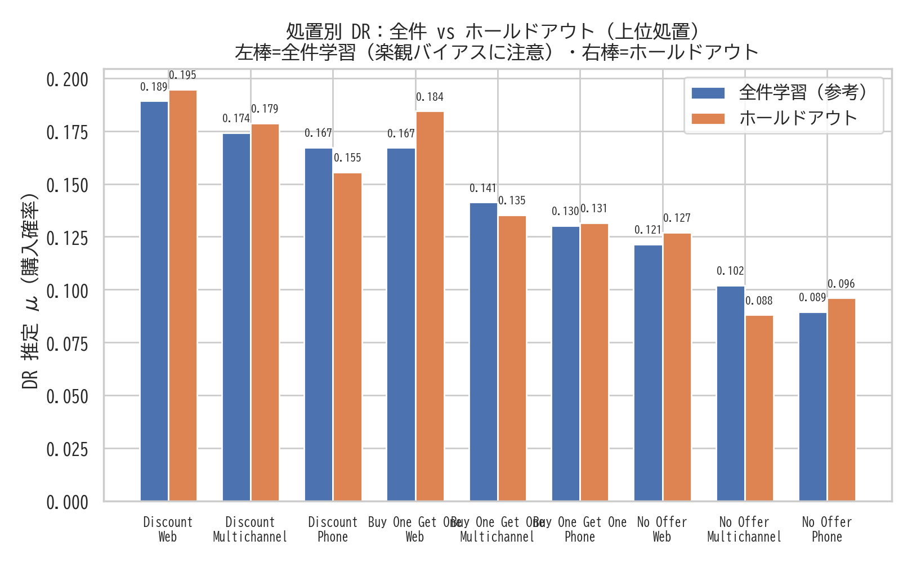

**考察（DR・全件 vs ホールドアウト）**: 本実装では **同一データ上で多項ロジスティック傾向モデルと結果モデルを学習** し、同じ標本で DR 式を評価している（サンプル分割による **cross-fitting は未使用**）。そのため **ナイーブな楽観バイアス** が生じうる。ホールドアウト分割で再学習した棒と比較し、**処置ごとのギャップ** が大きい場合は **過学習・極端な傾向スコア**・**弱い重み付き共通支援** を疑う。DR は **無視可能性と正しいモデル指定** の下で **二重頑健** だが、**未観測交絡** があると **漸近的にもバイアスは残る**。

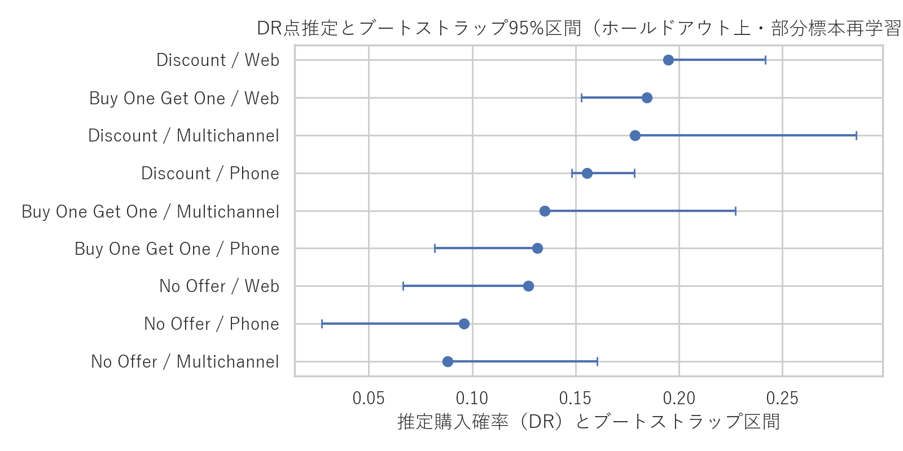

**考察（ブートストラップ区間）**: 実装は **訓練データの層化部分標本に対する再学習** に基づく。これは **全件ノンパラメトリック・ブートストラップ** とは分布が異なり、区間は **計算コストとのトレードオフ** で解釈する。処置間で **信頼区間が大きく重なる** 場合、オフライン上の **順位付けは確定的でない** → **A/B や順位付けRCT** が次のステップになる。

- 傾向スコア診断: `artifacts/propensity_diagnostics.csv`

### 6.4 傾向スコア分布（代表処置）と ESS

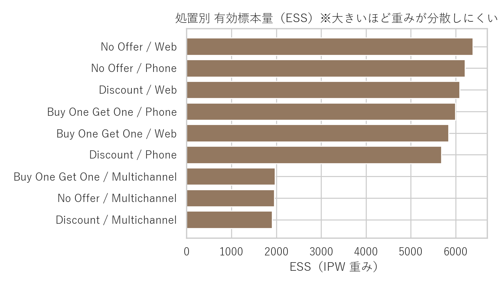

**考察（ESS 棒グラフ）**: 各処置について **逆確率重みの分散** を要約した **有効標本量（ESS）** を示す。ESS が極端に低い処置では、少数の観測に **過度に重みが乗る** ため、DR 点推定の **分散が爆発** しうる。そのような処置は **政策の主役から外す**・**傾向のトリミング**・**別の評価母集団** を検討する。

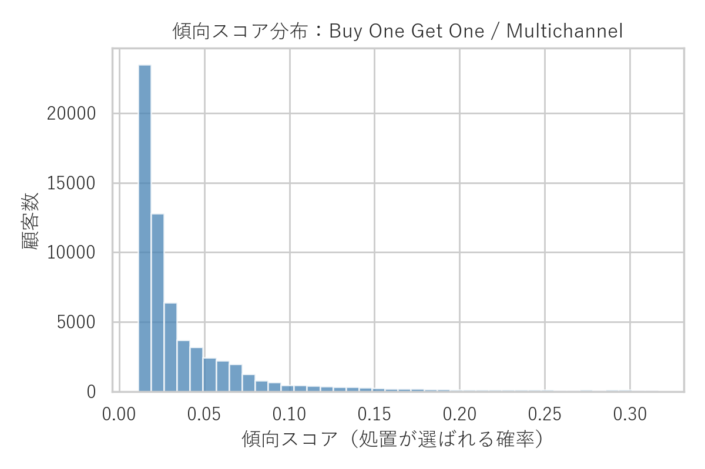

**考察（`propensity_hist_BuyOneGetOne_Multichannel`）**: このヒストグラムは **処置「BuyOneGetOne / Multichannel」** を受けた観測に対する **推定傾向スコア**（個体ごとの割当確率の予測）の分布である。質量が **0 に近い領域** に集中していれば、IPW 重みが大きくなり **ESS 低下** と整合する。複数処置で同様の形状なら **共通支援** は満たしやすいが、**狭いピーク** だけが突出する場合は **重みの不安定性** に注意する。

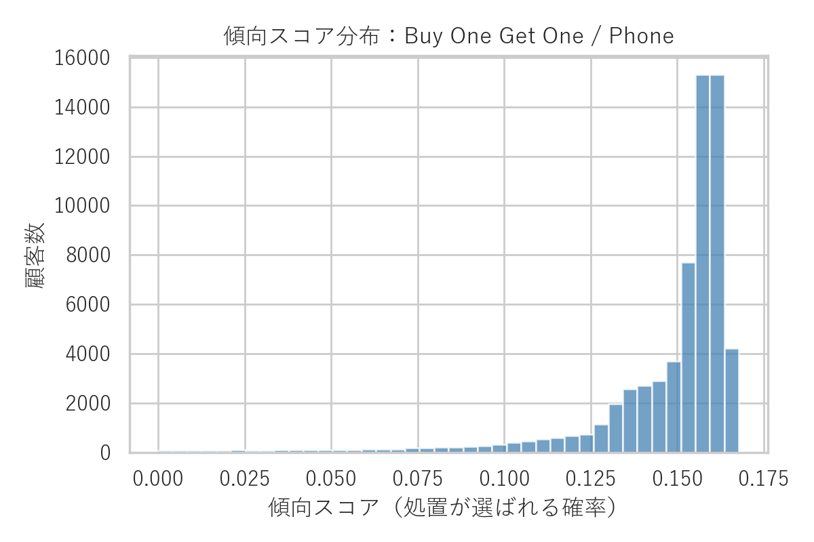

**考察（`propensity_hist_BuyOneGetOne_Phone`）**: このヒストグラムは **処置「BuyOneGetOne / Phone」** を受けた観測に対する **推定傾向スコア**（個体ごとの割当確率の予測）の分布である。質量が **0 に近い領域** に集中していれば、IPW 重みが大きくなり **ESS 低下** と整合する。複数処置で同様の形状なら **共通支援** は満たしやすいが、**狭いピーク** だけが突出する場合は **重みの不安定性** に注意する。

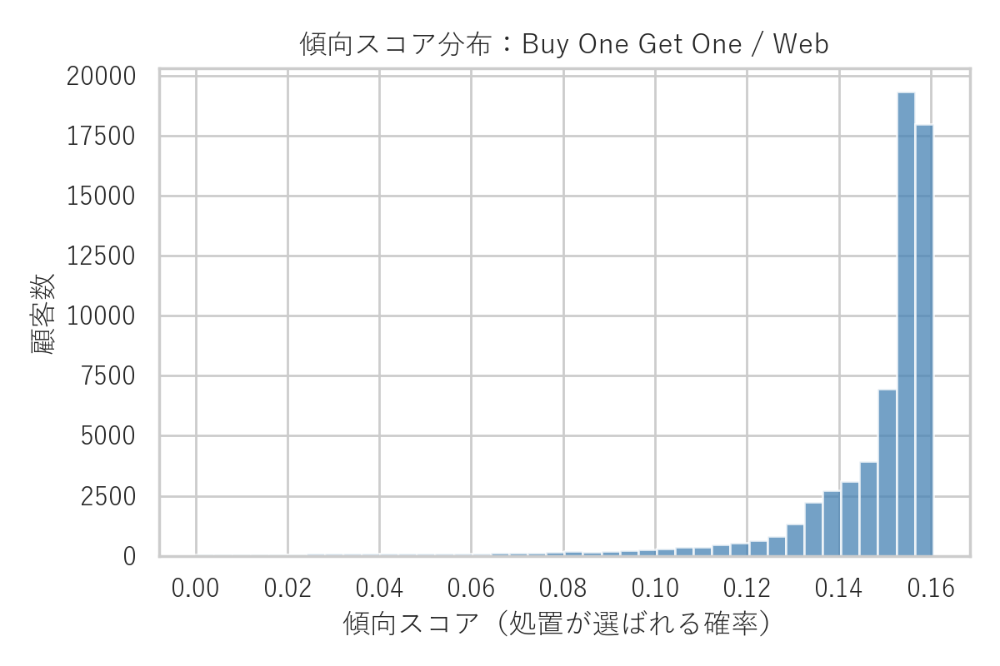

**考察（`propensity_hist_BuyOneGetOne_Web`）**: このヒストグラムは **処置「BuyOneGetOne / Web」** を受けた観測に対する **推定傾向スコア**（個体ごとの割当確率の予測）の分布である。質量が **0 に近い領域** に集中していれば、IPW 重みが大きくなり **ESS 低下** と整合する。複数処置で同様の形状なら **共通支援** は満たしやすいが、**狭いピーク** だけが突出する場合は **重みの不安定性** に注意する。

**考察（傾向スコア・総括）**: 傾向は **多値ロジスティック** で推定し、クリップを施している（`PROPENSITY_CLIP`）。それでも **モデル誤指定** や **高次元での極小確率** は残る。ESS とヒストグラムを **処置ごとにセット** で読み、**「その処置をオフラインで強く推す根拠は十分か」** を疑うことが、理系レポートとしての健全な読み方である。

## 7. 期待利益とOOF
- `artifacts/promo_targets.csv`（フル学習） / `artifacts/promo_targets_oof.csv` / `artifacts/promo_targets_holdout.csv`（ホールドアウト）
- 比較: `artifacts/policy_eval_compare.csv`（シナリオ別・フル/OOF/ホールドアウト平均利益・フルvsOOF一致率）
- シナリオ間感度: `artifacts/policy_scenario_sensitivity.csv`
- ベンチマーク: `artifacts/policy_benchmarks.csv`

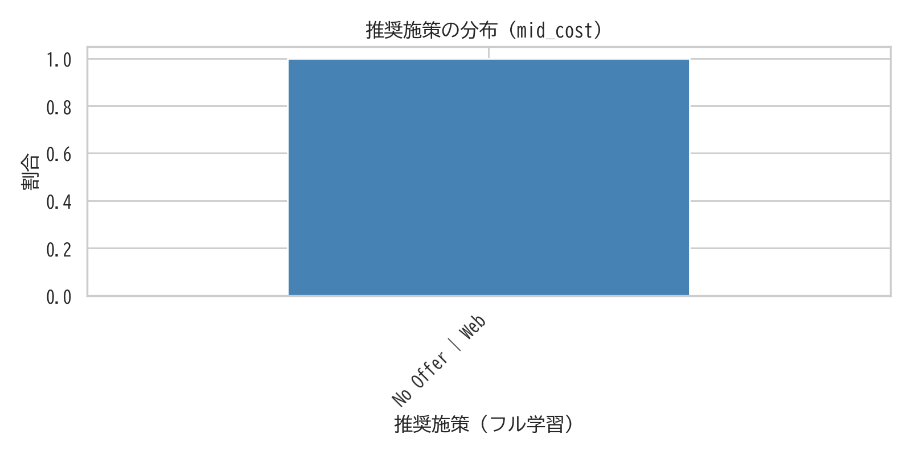

**考察（推奨処置の分布）**: 各棒は **顧客ごとに期待利益最大の処置を割り当てたときの、処置の相対頻度** を示す。コストシナリオを変えると **最頻処置が入れ替わる** のは、目的関数が **離散かつ非線形** なためである。100% 一処置に集中する場合は **コストが高いインセンティブを全員に打つのが支配的に不利** な状況を示唆するが、**モデル誤差** でも起こりうるため OOF と照合する。

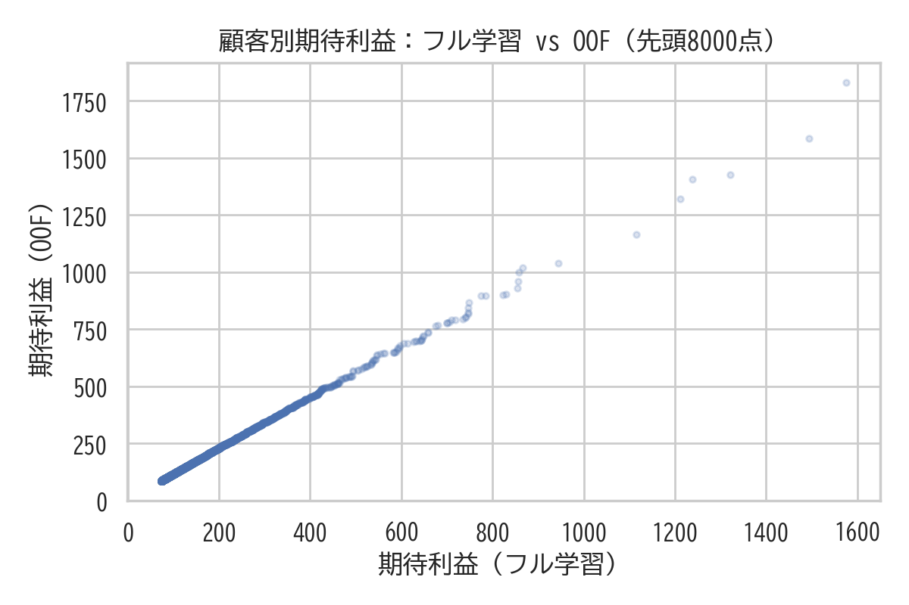

**考察（フル学習 vs OOF 期待利益・散布図）**: 各点は顧客 $i$ について **フル学習モデル** と **$K$ 折 OOF 予測** から計算した期待利益のペアである。対角線からの **系統的な上方ずれ** は **楽観バイアス**（同一データで学習したスコアで評価）を示唆する。散布が **対角線に密着** していれば、オフライン上の順位付けは **ある程度頑健** と解釈できる。

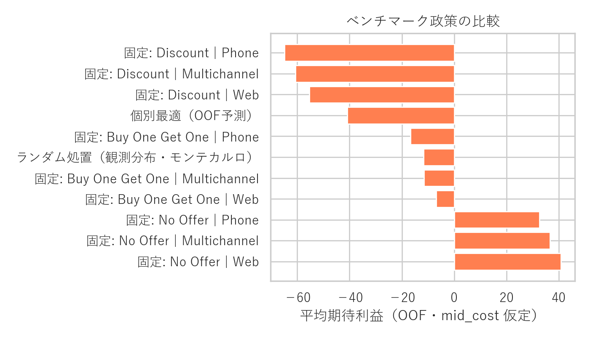

**考察（ベンチマーク政策・棒グラフ）**: 「常に同一処置」「ランダム割当」等の **単純ルール** との平均期待利益比較は、**複雑なML政策が本当に勝っているか** の **下限基準線** を与える。ベンチマークに大差がつかないなら、**運用コストを踏まえ単純ルール** の方が望ましい場合がある。

**考察（政策評価・総括）**: オフポリシー評価は **観察された行動方針と異なる政策** をシミュレートするが、**共通支援の外** の処置・顧客への外挿は **モデル依存** である。よって **ホールドアウト**・**感度分析**・**実験** の三段で補強する。

### 7.0 評価モード別の平均期待利益（棒グラフ）

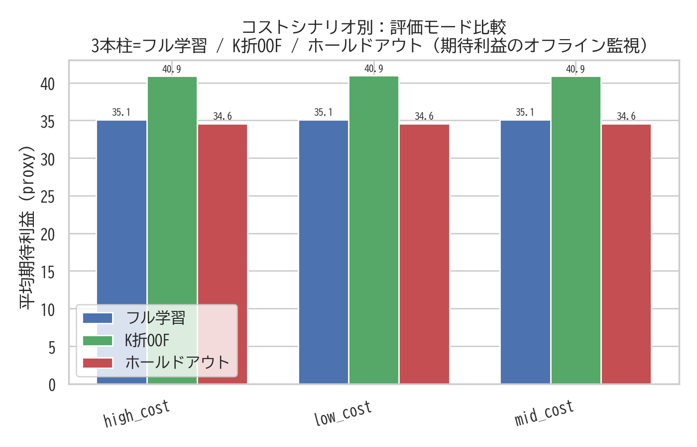

**考察（評価モード別・平均期待利益）**: **フル** は同一データで学習したモデルによる評価、**OOF** は **アウトオブフォールド予測** による評価、**ホールドアウト** は **保持検証セット** による評価である。フルが一貫して大きい場合は **過信** の警告信号。OOF とホールドアウトの両方で **同符号・同程度** なら、オフライン結論の **再現性** は高いと言いうる。いずれも **コスト仮定** に依存する点は変わらない。

### 7.1 コストシナリオ別サマリ
| シナリオ | n | 利益>0割合 | 平均期待利益 | 中央値 |
| --- | ---: | ---: | ---: | ---: |
| high_cost | 64000 | 1.0000 | 35.11 | 16.88 |
| low_cost | 64000 | 1.0000 | 35.11 | 16.88 |
| mid_cost | 64000 | 1.0000 | 35.11 | 16.88 |

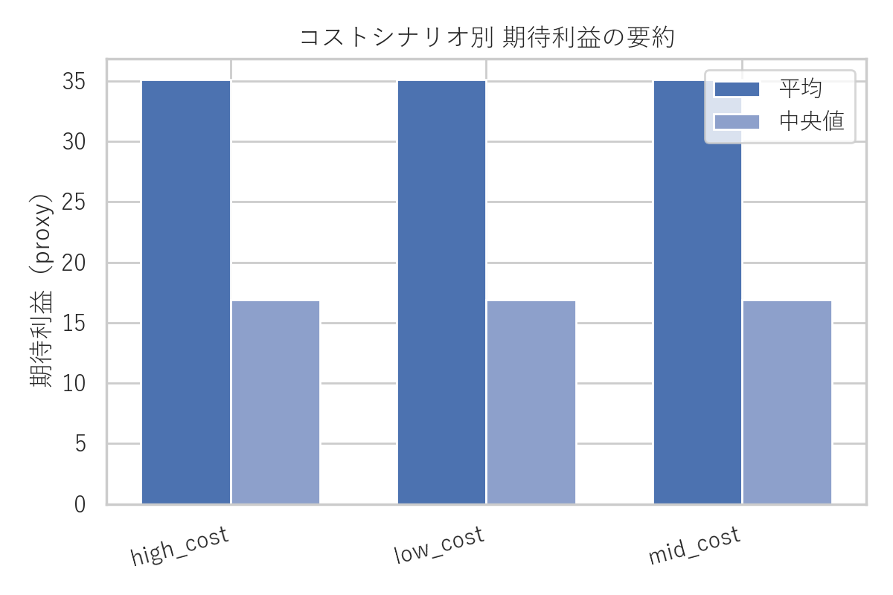
**考察（シナリオ別・平均・中央値）**: 本設定では複数シナリオで **数値が同一** に見える場合がある（コスト係数が同値に設定されている等）。その場合でも **図表を省略せず掲載** し、将来パラメータを変えたときの **差分が追える** ようにする。平均と中央値の乖離が大きいときは **テールリスク** を議論に含める。

### 7.2 セグメント別 平均期待利益（可視化）

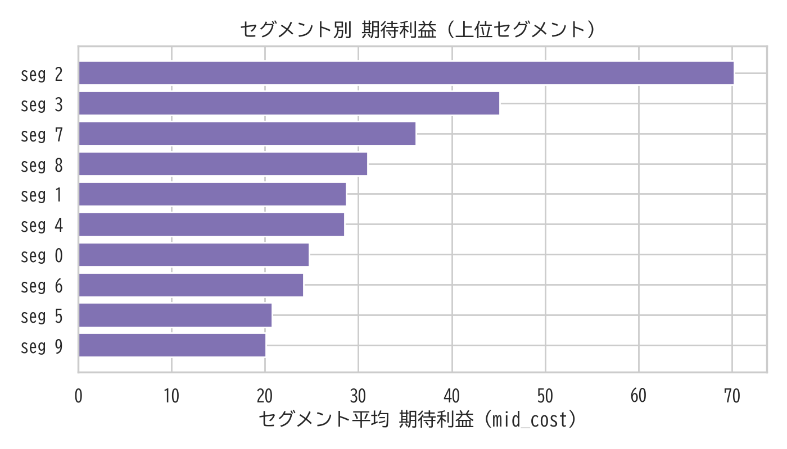
**考察（セグメント別・平均期待利益バー）**: 棒高は **クラスタ内での期待利益の標本平均** である。$n$ が小さいクラスタは **標準誤差が大** きく、**色の順位** を過信しない。セグメント間の差が **ブートストラップ区間で重なる** なら、**セグメント別の差別化** は統計的に弱い。

## 8. 制約付き配信（貪欲近似）
- `artifacts/promo_targets_constrained_mid_cost.csv`
- 図: 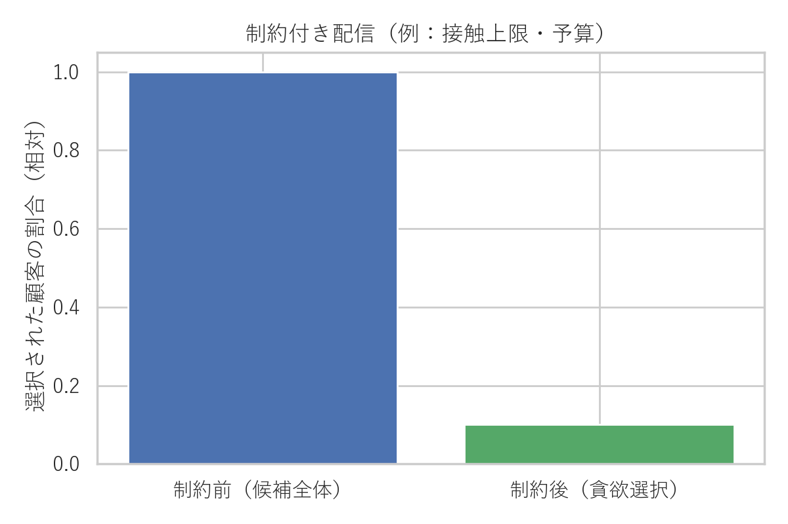

**考察（制約付き配信・貪欲近似）**: 実務では **接触上限・予算・チャネルキャパ** により、全員に最適処置を配れない。**貪欲法** は逐次に限界効用の高い顧客を選ぶ近似だが、**整数制約付き最適化の最適解** と一致するとは限らない。図は **制約前後で何割が配信対象から落ちたか** のイメージであり、パラメータは **実キャパ** に合わせて再調整する。LP/MIP やラグランジュ緩和との **ギャップ評価** は今後の拡張課題である。

## 9. 経営向けゲート・リスク・KPI感度
- `artifacts/kpi_bridge_sensitivity.csv` / `artifacts/risk_register.json` / `artifacts/decision_gate_README.md`
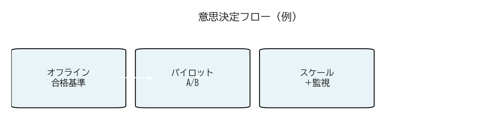

**考察（意思決定フロー）**: フロー図は **スケール前に通すべきゲート** の例示である。ESS 閾値、**校正ドリフト**、**OOF 期待利益の下限** 等は組織で **数値目標化** し、逸脱時は **配信縮小・モデル停止・再学習** を手順化する。ゲート無しのスケールは **統計的リスクとコンプライアンスリスク** を同時に増やす。

## 10. 実験設計（A/B）
- `artifacts/ab_design.csv` / LaTeX: `artifacts/tables/ab_design.tex`

**考察（A/B 設計表）**: 表の必要サンプルは **二標本の比例差** に対する **正規近似** に基づく **出発点** である。実務では **無効検査の除外**、**多重主アウトカム**（族誤り率）、**クラスタランダム化**（店舗単位）、**期間による季節性** を設計に織り込む。オフラインで効いていた政策が実験で再現しない場合、**実装バグ**、**SUTVA 違反**（在庫切れ）、**交絡の残存** を疑う。

## 11. ガバナンス・モニタリング
- `artifacts/data_dictionary.md` / `artifacts/tables/governance_ethics.tex`（LaTeX用）
- `artifacts/monitoring_spec.json` / `artifacts/monitoring_spec.yaml` / `artifacts/tables/monitoring_summary.tex`

**考察（ガバナンス・モニタリング）**: データ辞書は **利用目的の限定・保存期間・第三者提供** の説明責任のたたき台である。モニタリング表は **本番KPIの閾値とエスカレーション** を定義する。いずれも **法的助言や完全なコンプライアンスチェックリスト** ではなく、**法務・DPO・情報セキュリティ** とのレビューを前提に版管理する。

## 12. 限界と次の検証
- 観察データ・未観測交絡。DRブートストラップは部分標本再学習であり、完全な因果保証はしない。
- 詳細は `latex/final_report.tex`（LuaLaTeX）を参照。

**考察（限界・次の一手）**: (1) **観察研究**としての限界—未観測交絡、SUTVA 違反、**慣習化**。(2) **オフライン利益**は proxy とコスト仮定に依存。(3) **ブートストラップ**は部分再学習であり、厳密な頑健区間の代わりではない。次の検証は **パイロットRCT**、**長期LTVの別データ連携**、**在庫・供給制約の明示モデル化** が中心になる。

## 付録：生成物
- `analytics/` パッケージ, `run_analysis.py`, `artifacts/`, `figures/`, `figures/improvements/`
